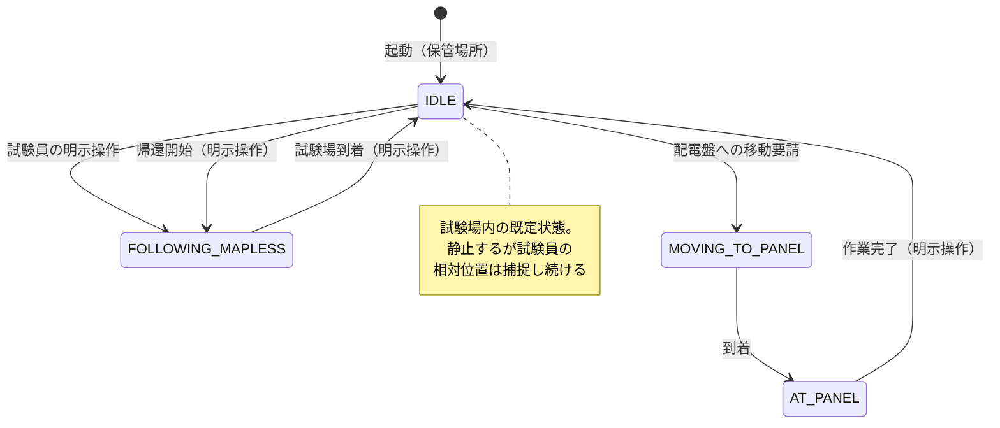

# VISION.md — TH システム完成形

このドキュメントは、TH システム（配電盤上部確認ロボット移動機構）の**目指す完成形**を記述する。
読者は開発者本人と、コーディングを行う AI。

**運用ルール**: 方針を変更する際は、コードを修正する前に必ずこのドキュメントの該当箇所を更新する。
コードとこの文書が食い違う場合、この文書が正であり、実装を追いつかせる（詳細は CLAUDE.md「方針変更時のルール」）。
`docs/architecture.md` は現状実装の記述（as-built）であり、本書は目指す姿（to-be）である。

---

## 1. 目的とユースケース

配電盤の上部確認試験において、カメラ昇降機構を搭載したクローラーロボットが試験員に同行し、
試験員の指示で配電盤前に移動して撮影作業を支援する。

**1 日の運用の流れ（完成形）**:

1. 保管場所でロボットを起動し、試験員が追従モードを開始する
2. ロボットは試験員を追従して保管場所から試験場まで移動する（地図なし追従）
3. 試験場に着いたら試験員がロボットを待機させる。ロボットは付近で静止するが、試験員の位置は捕捉し続ける
4. 試験員の要請があったとき**のみ**、指定された配電盤前まで自律移動する（SLAM 地図 + Nav2）
5. 配電盤前で撮影作業（カメラ昇降は外部システム）。完了したら待機に戻る
6. 4〜5 を必要な配電盤の数だけ繰り返す
7. 全作業終了後、試験員を追従して保管場所に戻る（地図なし追従）

**設計方針の要点**: 初期設計では「常に試験員について回る」想定だったが、現在は
**「保管場所⇔試験場の移動時のみ追従し、試験場内では付近待機 + 要請時のみ移動」**に変更した。
試験場内で常に追従すると試験員の作業の邪魔になり、狭い場所での衝突リスクも増えるため。

## 2. 運用フロー全体像

- **保管場所 ⇔ 試験場の移動**: `FOLLOWING_MAPLESS`（地図なし追従）。往路・復路とも同じ。
- **試験場内の既定状態**: `IDLE`（付近待機）。専用の待機モードは作らない。
- **配電盤への移動**: 試験員の明示操作をトリガーに `MOVING_TO_PANEL`（SLAM 地図 + Nav2）。
- **モード切替はすべて試験員の明示操作**（タブレット UI または CLI）。自動遷移はフォルト時の IDLE 強制遷移と、MOVING_TO_PANEL → AT_PANEL の到着遷移のみ。

## 3. モード別の完成形挙動

| モード | 番号 | 完成形の挙動 |
| --- | --- | --- |
| IDLE | 1 | 静止待機。**ただし試験員の相対位置捕捉は継続する**（§4）。試験場内での既定状態 |
| FOLLOWING | 2 | 地図あり追従（Nav2 経由）。広い試験場での見失い防止に使える可能性があるが、**実装・調整の優先度は低い**（§7） |
| MOVING_TO_PANEL | 3 | 試験員が指定した配電盤前まで SLAM 地図 + Nav2 で自律移動 |
| AT_PANEL | 4 | 配電盤前で静止。外部のカメラ昇降システムが作業。完了通知で IDLE に戻る |
| MANUAL | 5 | タブレットからの手動ジョグ操作。位置合わせの微調整・リカバリ用 |
| ESTOP | 6 | 緊急停止。発動・解除は分離されており、復帰は IDLE 経由のみ |
| FOLLOWING_MAPLESS | 7 | 地図なし追従。**保管場所⇔試験場の移動専用**。地図・Nav2 に依存せず、LiDAR 脚検知の相対位置だけで追従する |

各モードの共通ルール:

- ロボットが操作者の意図しないタイミングで動き出さないこと。IDLE からの遷移は明示操作のみ。
- 追従対象を見失った場合（is_lost）は安全に停止する。勝手に探索走行で動き回らない（その場旋回での再捜索は可）。
- 追従対象の誤切替（近くの別人に乗り移る）を防ぐこと。

## 4. 試験員の位置捕捉の扱い

**完成形**: 人物捕捉（LiDAR 脚検知 → `/person/status`）はモードに関係なく**常時動作**させる。
IDLE 中も止めない。

理由:

- 待機中に「試験員が指定した位置へ移動する」処理（将来機能）を即座に開始できるようにするため
- 追従再開時に対象を選び直す手間・誤選択リスクを減らすため

注意: IDLE 中は位置を捕捉していても**速度指令は一切出さない**。捕捉の継続と移動の可否は独立している。

## 5. 安全設計の完成形

現在の安全アーキテクチャは完成形としてもそのまま維持する。変更しない。

- すべての速度指令は twist_mux 経由。`/cmd_vel` へ直接 publish するノードを追加してはいけない（CLAUDE.md 不変ルール）
- `safety_monitor` のフォルト検知 → twist_mux ロック → 物理停止は 100ms 以内。`mode_manager` の処理を待たない
- ESP32 の独立ウォッチドッグ（300ms）が ROS2 クラッシュ時の最終保証
- フォルト発生時は動作系モードから IDLE へ強制遷移
- ESTOP はどのモードからも発動可能、復帰は IDLE 経由のみ

## 6. WebUI 設定・パラメータ調整

**完成形**: タブレット WebUI から追従・センサー関連のチューニングパラメータを確認・変更できる。
これまで CLI（`ros2 param set`、`docs/architecture.md` のパラメータチューニングガイド参照）でしか
できなかった調整をタブレット単体で完結させ、現場での微調整の敷居を下げる。

- **対象パラメータ（初期スコープ）**: `follow_planner_mapless`（保管場所⇔試験場の主追従モード）の
  数値パラメータ（`update_rate_hz` を除く。制御ループの周期は起動時に固定されておりライブ変更が
  効かない上、内部計算の除数のため 0 を送るとノードがクラッシュするため対象外とした）、
  および `lidar_filter` の `blind_angle_ranges`（LiDAR 死角マスク）。
  `follow_planner`（地図あり追従）・`person_predictor`・Nav2 パラメータ・`panels.yaml` は対象外
  （対象拡大は未定・下記参照）。
- **反映**: 変更は即座に対象ノードへ実行時反映される。ただし再起動すると YAML のデフォルト値に戻る。
- **永続化**: 明示的な「保存」操作で、変更内容を該当する `config/*.yaml` に書き戻す。保存しない限り
  再起動で失われる。
- **安全ガード**: パラメータ変更（実行時反映・保存とも）は `IDLE` / `MANUAL` モード中のみ許可する。
  追従・自律移動中（`FOLLOWING_MAPLESS` / `FOLLOWING` / `MOVING_TO_PANEL` / `AT_PANEL`）および
  `ESTOP` 中は変更不可とし、意図しないタイミングでの挙動急変を防ぐ。モード判定は UI 側の表示制御
  だけでなく ROS2 側（変更を仲介する専用ノード）でも行い、UI の見た目に依存しない担保とする。
- WebUI は変更対象ノードの `set_parameters` を直接呼ぶのではなく、モード判定と YAML 書き込みを
  一手に引き受ける専用ノードを常に経由する。

## 7. 未確定・将来検討事項

決まっていないこと、優先度が低いことを明示的に残す。決まったら該当セクションに昇格させる。

- **WebUI 設定・パラメータ調整の対象拡大**: `follow_planner`（地図あり追従）・`person_predictor`・
  Nav2 パラメータ・`panels.yaml`（配電盤座標、現状 `web_ui/src/App.jsx` 側と二重管理）への対象拡大は
  未定
- **FOLLOWING（地図あり追従）の位置付け**: 広い試験場で試験員を見失わないために使えるかもしれないが、実装・調整の優先度は低い。当面 FOLLOWING_MAPLESS と IDLE 待機で運用を成立させることを優先する
- **待機中の「指定位置への移動」機能**: §4 の常時捕捉はこの布石。位置の決め方は以下の 3 方式を想定する（暫定決定・2026-07）。優先順位・実装順は未確定
  1. **呼び寄せ**: 常時捕捉している試験員の相対位置を目標に接近・停止する。座標入力不要で、既存の追従ロジック（接近停止・誤切替防止）を流用できる
  2. **地図タップ指定**: タブレット UI に地図を表示し、タップ位置を目標にする。受け口（`/manual/target_pose` → TF 変換 → Nav2）は実装済みだが、UI 側の地図表示・タップ座標変換は未実装。現状 MANUAL モード限定 + ハートビート必須の制約があり、待機中運用に合わせた見直しが必要
  3. **専用指定デバイス**: 試験員が持つ距離計 + 姿勢計を備えたデバイスで対象を指し、測距値・デバイス姿勢・試験員の相対位置（ロボットが捕捉）を合成して目標座標を算出する。デバイスの方位基準とロボット座標系の整合（ヨー角の合わせ方）が技術課題。ハードウェア含め未着手
- **カメラ昇降システムとの連携**: AT_PANEL 到着通知・作業完了通知のインターフェース詳細は外部システム側の仕様待ち
- **試験場の地図運用**: **事前に試験場ごとに作成しておく（暫定決定・2026-07）**。判断基準は「作成が簡単なら毎回その場で作成、専門技術や時間が必要なら事前作成」であり、現状の手順（キーボードテレオペでスリップに注意しながら周回・RViz 目視・CLI 保存・オドメトリキャリブレーションと時刻同期が前提・配電盤座標を RViz で実測して panels.yaml に手入力）は後者に該当するため。将来、地図作成と配電盤登録が試験員だけで完結するほど簡単になれば「毎回作成」に切り替えてよい
  - 未解決の課題: 現状は地図（th_map.yaml）と配電盤座標（panels.yaml）が各 1 セットのみで、**複数の試験場を切り替える仕組みがない**。試験場ごとの「地図 + 配電盤座標」セットの保存・選択方法は未設計
- **PERSON_TRACKER_LOST のロック範囲**: 現状 `safety_monitor` は `/person/status` の途絶をモードに関係なく監視し、フォルト時は twist_mux を全モード共通でロックする。つまりトラッカー無応答時は人物データを必要としない MANUAL ジョグや MOVING_TO_PANEL まで動けなくなる。新運用（試験場内は待機・要請時のみ配電盤へ移動）でこの仕様が妥当か、人物データを使うモード（FOLLOWING_MAPLESS / FOLLOWING / 将来の呼び寄せ）に限定すべきかは未決定

## 8. 実装状況トラッキング

完成形の各項目に対する現状。方針変更やマイルストーン到達時に更新する。

| # | 完成形の項目 | 状態 | 備考 |
| --- | --- | --- | --- |
| 1 | FOLLOWING_MAPLESS での追従（実機） | ✅ 実装済 | 実機検証済み。速度制御・ロスト時停止・接近時停止・誤切替防止まで対応 |
| 2 | ESTOP 発動/解除の分離・キーボード操作 | ✅ 実装済 | |
| 3 | 追従対象の選択 UI・手動ジョグ | ✅ 実装済 | |
| 4 | IDLE 待機（静止） | ✅ 実装済 | |
| 5 | IDLE 中の人物捕捉の常時継続 | 🔧 実装中 | 構成は完成形通り（認識パイプラインはモード非依存で常時起動、`/robot/mode` を購読するノードなし）。ただし安定性が未証明: DR-SPAAM のセグフォは respawn で自動復旧するが再起動中はフォルトロックが入りうる。PersonTracker（コンポーザブルノード）はコンテナに respawn がなく lifecycle の bond も無効（bond_timeout 0.0）のため、ハング・クラッシュ時に自動復旧しない。起動失敗2件はコミット 1d9f3df で対処済みだが長時間運用で未証明 |
| 6 | MOVING_TO_PANEL（配電盤への自律移動、実機） | ❓ 要確認 | panel_navigator は存在するが実機での検証状況を要確認 |
| 7 | AT_PANEL の作業フロー | ❓ 要確認 | 外部システム連携が未確定（§7） |
| 8 | 試験場での SLAM 走行（実機） | ❓ 要確認 | 地図作成・保存・再利用の実機運用手順を要確認 |
| 9 | FOLLOWING（地図あり追従） | ⏸ 優先度低 | §7 参照 |
| 10 | 待機中の指定位置への移動 | ⏸ 未着手 | §7 参照。位置指定は呼び寄せ / 地図タップ / 専用指定デバイスの 3 方式を想定（暫定）。地図タップの受け口（/manual/target_pose）のみ実装済み |
| 11 | WebUI 設定・パラメータ調整 | 🔧 実装中 | follow_planner_mapless + lidar_filter.blind_angle_ranges が対象。IDLE/MANUAL のみ変更可（§6） |
| 12 | オドメトリ精度向上（9軸IMUセンサフュージョン） | 🔧 実装中 | 超信地旋回時のスリップによるyawドリフトを抑えるため、DSR1603(BNO055)をESP32のI2Cに追加しEKF(robot_localization)でyaw/vyawを補正する方針を決定（2026-07）。プロトコル・配線・キャリブレーション手順の詳細は docs/architecture.md「オドメトリとセンサフュージョン」参照 |

凡例: ✅ 実装済（実機で確認） / 🔧 実装中 / ❓ 要確認（実装はあるが完成形との一致を未検証） / ⏸ 未着手・優先度低
