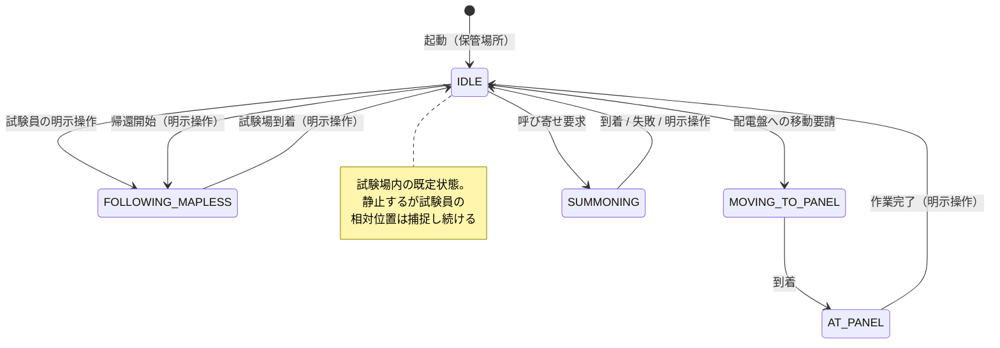

# VISION.md — TH システム完成形

このドキュメントは、TH システム（配電盤上部確認ロボット移動機構）の**目指す完成形**を記述する。
読者は開発者本人と、コーディングを行う AI。

**運用ルール**: 方針を変更する際は、コードを修正する前に必ずこのドキュメントの該当箇所を更新する。
コードとこの文書が食い違う場合、この文書が正であり、実装を追いつかせる（詳細は CLAUDE.md「方針変更時のルール」）。
`docs/architecture.md` は現状実装の記述（as-built）であり、本書は目指す姿（to-be）である。

---

## 1. 目的とユースケース

配電盤の上部確認試験において、カメラ昇降機構を搭載したクローラーロボットが試験員に同行し、
試験員の指示で配電盤前に移動して撮影作業を支援する。

**1 日の運用の流れ（完成形）**:

1. 保管場所でロボットを起動し、試験員が追従モードを開始する
2. ロボットは試験員を追従して保管場所から試験場まで移動する（地図なし追従）
3. 試験場に着いたら試験員がロボットを待機させる。ロボットは付近で静止するが、試験員の位置は捕捉し続ける
4. 試験員の要請があったとき**のみ**、指定された配電盤前まで自律移動する（SLAM 地図 + Nav2）
5. 配電盤前で撮影作業（カメラ昇降は外部システム）。完了したら待機に戻る
6. 4〜5 を必要な配電盤の数だけ繰り返す
7. 全作業終了後、試験員を追従して保管場所に戻る（地図なし追従）

**設計方針の要点**: 初期設計では「常に試験員について回る」想定だったが、現在は
**「保管場所⇔試験場の移動時のみ追従し、試験場内では付近待機 + 要請時のみ移動」**に変更した。
試験場内で常に追従すると試験員の作業の邪魔になり、狭い場所での衝突リスクも増えるため。

## 2. 運用フロー全体像

- **保管場所 ⇔ 試験場の移動**: `FOLLOWING_MAPLESS`（地図なし追従）。往路・復路とも同じ。
- **試験場内の既定状態**: `IDLE`（付近待機）。専用の待機モードは作らない。
- **配電盤への移動**: 試験員の明示操作をトリガーに `MOVING_TO_PANEL`（SLAM 地図 + Nav2）。
- **呼び寄せ**: 試験員の明示操作をトリガーに `SUMMONING`（現在捕捉中の試験員位置へ Nav2 で一度だけ接近・停止）。
- **モード切替はすべて試験員の明示操作**（タブレット UI または CLI）。自動遷移はフォルト時の IDLE 強制遷移と、MOVING_TO_PANEL → AT_PANEL / SUMMONING → IDLE の到着遷移のみ。

## 3. モード別の完成形挙動

| モード | 番号 | 完成形の挙動 |
| --- | --- | --- |
| IDLE | 1 | 静止待機。**ただし試験員の相対位置捕捉は継続する**（§4）。試験場内での既定状態 |
| FOLLOWING | 2 | 地図あり追従（Nav2 経由）。広い試験場での見失い防止に使える可能性があるが、**実装・調整の優先度は低い**（§8） |
| MOVING_TO_PANEL | 3 | 試験員が指定した配電盤前まで SLAM 地図 + Nav2 で自律移動 |
| AT_PANEL | 4 | 配電盤前で静止。外部のカメラ昇降システムが作業。完了通知で IDLE に戻る |
| MANUAL | 5 | タブレットからの手動ジョグ操作。位置合わせの微調整・リカバリ用 |
| ESTOP | 6 | 緊急停止。発動・解除は分離されており、復帰は IDLE 経由のみ |
| FOLLOWING_MAPLESS | 7 | 地図なし追従。**保管場所⇔試験場の移動専用**。地図・Nav2 に依存せず、LiDAR 脚検知の相対位置だけで追従する |
| SUMMONING | 8 | 呼び寄せ。常時捕捉している試験員の相対位置へ Nav2 で一度だけ接近・停止し、到着後は自動で IDLE に戻る。AT_PANEL のような外部作業待ちの保持状態は持たない |

各モードの共通ルール:

- ロボットが操作者の意図しないタイミングで動き出さないこと。IDLE からの遷移は明示操作のみ。
- 追従対象を見失った場合（is_lost）は安全に停止する。勝手に探索走行で動き回らない（その場旋回での再捜索は可）。
  - **デバウンス（2026-07-24 決定）**: `is_lost` が単発の検知ミス（DR-SPAAM は約2Hzでしか
    推論されず、1フレームのミスで一瞬 true になり得る）で瞬間的に反転しただけで完全停止すると、
    実機で「十分離れているのに頻繁に一瞬止まる」挙動になることを確認した。`follow_planner_mapless`
    は `is_lost` が `lost_debounce_sec`（既定 0.3 秒）以上継続した場合にのみ停止する。それ未満は
    自己移動補償した直近の既知位置で追従を継続する。障害物検知・接近時の停止にはデバウンスを
    適用しない（即時停止のまま）。
- 追従対象の誤切替（近くの別人に乗り移る）を防ぐこと。

## 4. 試験員の位置捕捉の扱い

**完成形**: 人物捕捉（LiDAR 脚検知 → `/person/status`）はモードに関係なく**常時動作**させる。
IDLE 中も止めない。

理由:

- 待機中に「試験員が指定した位置へ移動する」処理（将来機能）を即座に開始できるようにするため
- 追従再開時に対象を選び直す手間・誤選択リスクを減らすため

注意: IDLE 中は位置を捕捉していても**速度指令は一切出さない**。捕捉の継続と移動の可否は独立している。

## 5. 安全設計の完成形

現在の安全アーキテクチャは完成形としてもそのまま維持する。変更しない。

- すべての速度指令は twist_mux 経由。`/cmd_vel` へ直接 publish するノードを追加してはいけない（CLAUDE.md 不変ルール）
- `safety_monitor` のフォルト検知 → twist_mux ロック → 物理停止は 100ms 以内。`mode_manager` の処理を待たない
- ESP32 の独立ウォッチドッグ（300ms）が ROS2 クラッシュ時の最終保証
- フォルト発生時は動作系モードから IDLE へ強制遷移
- ESTOP はどのモードからも発動可能、復帰は IDLE 経由のみ

**フォルト種別ごとの適用範囲（2026-07-24 決定）**: 上記は LIDAR_LOST / ESP32_DISCONNECTED
（走行そのものが安全に継続できない致命的故障）に適用する。PERSON_TRACKER_LOST（試験員追跡
データの途絶）は性質が異なり、**試験員位置に依存するモード（FOLLOWING / FOLLOWING_MAPLESS /
SUMMONING）でのみ** IDLE へ強制遷移させ、twist_mux の物理ロック（`/safety/fault_lock`）には
含めない。MANUAL（手動ジョグ）・MOVING_TO_PANEL・AT_PANEL・IDLE は試験員データを使わないため、
トラッカー無応答中でも動作を継続できる（§8 の旧「未決定」項目を解決）。

## 6. WebUI 設定・パラメータ調整

**完成形**: タブレット WebUI から追従・センサー関連のチューニングパラメータを確認・変更できる。
これまで CLI（`ros2 param set`、`docs/architecture.md` のパラメータチューニングガイド参照）でしか
できなかった調整をタブレット単体で完結させ、現場での微調整の敷居を下げる。

- **対象パラメータ（初期スコープ）**: `follow_planner_mapless`（保管場所⇔試験場の主追従モード）の
  数値パラメータ（`update_rate_hz` を除く。制御ループの周期は起動時に固定されておりライブ変更が
  効かない上、内部計算の除数のため 0 を送るとノードがクラッシュするため対象外とした）、
  および `lidar_filter` の `blind_angle_ranges`（LiDAR 死角マスク）。
  `follow_planner`（地図あり追従）・`person_predictor`・Nav2 パラメータ・`panels.yaml` は対象外
  （対象拡大は未定・下記参照）。
- **反映**: 変更は即座に対象ノードへ実行時反映される。ただし再起動すると YAML のデフォルト値に戻る。
- **永続化**: 明示的な「保存」操作で、変更内容を該当する `config/*.yaml` に書き戻す。保存しない限り
  再起動で失われる。
- **安全ガード**: パラメータ変更（実行時反映・保存とも）は `IDLE` / `MANUAL` モード中のみ許可する。
  追従・自律移動中（`FOLLOWING_MAPLESS` / `FOLLOWING` / `MOVING_TO_PANEL` / `AT_PANEL`）および
  `ESTOP` 中は変更不可とし、意図しないタイミングでの挙動急変を防ぐ。モード判定は UI 側の表示制御
  だけでなく ROS2 側（変更を仲介する専用ノード）でも行い、UI の見た目に依存しない担保とする。
- WebUI は変更対象ノードの `set_parameters` を直接呼ぶのではなく、モード判定と YAML 書き込みを
  一手に引き受ける専用ノードを常に経由する。

## 7. 音声フィードバック

**背景**: 安全処理（フォルト検知・追跡ロスト・退避不可など）でロボットが停止・待機状態に入っても、
試験員は前方を歩いておりタブレット画面を見ていないため気付けない。現状のフィードバックは WebUI の
バッジ表示のみで、視線を要求する手段しかないことがこの機能の出発点である。

### 7.1 受け手の切り分け

| 受け手 | 手段 | 本節の対象 |
| --- | --- | --- |
| 試験員（タブレット所持者） | **音声アナウンス** | ✅ 対象 |
| 周囲の作業者 | **ブザー・ランプ**（将来設置） | ❌ 対象外（§8） |

ロボットが予期せず動き出すこと（捜索旋回・退避）の**周囲への予告は音声では行わない**。
音声は試験員の手元でのみ鳴るため周囲には届かず、この用途には将来設置するブザー・ランプで対応する。
この切り分けにより、音声機能は WebUI 内で完結する。

### 7.2 再生場所は WebUI に閉じる

音声はすべて**タブレット WebUI（ブラウザ）で再生する**。ロボット側スピーカーは持たない。

理由:

- タブレットは試験員が携行しているため、「試験員に気付かせる」目的に対して音源位置が最も正しい
- 安全通知の主要部（フォルト・E-Stop・モード強制遷移・復旧）に必要なトピックは WebUI が既に
  購読済み（`/robot/mode`・`/safety/fault`・`/safety/estop`・`/person/status`）であり、
  新規 ROS2 ノードを要しない。ただし追従ロジック由来の待機（C3・C4・C7・C8）は §7.8 の
  状態 publish が前提となる
- ロボット側に置く場合に必要となる音声デバイスのパススルー（`/dev/snd`・WSLg・`PULSE_SERVER`）、
  ラズパイへの音声パッケージ導入、SoftAP 越し DDS リンクへの依存がすべて不要になる
- タブレットとの通信断（heartbeat 途絶・rosbridge 切断）は、ブラウザ側が自分の WebSocket 切断として
  クライアント内で直接検知できる。ロボット側ノードからは原理的に通知できない事象であり、
  この一点においては WebUI 再生でなければ成立しない

### 7.3 2 つのレイヤと独立オンオフ

音声は目的の異なる 2 レイヤで構成し、**それぞれ独立してオンオフできる**ものとする。
設定はタブレット側に永続化する。

| レイヤ | 目的 | 想定 |
| --- | --- | --- |
| **安全通知** | システム都合の停止・待機・復帰に気付かせる | 実運用の既定でオン |
| **デモ実況** | ロボットの判断根拠を観客に説明する | 発表・動作紹介時のみオン |

「安全通知オン・デモ実況オフ」が通常運用の既定状態、発表時のみ両方オンという使い分けを想定する。

### 7.4 発話設計ルール

1. **第一声のみ**。補足を続ける二段構えは採用しない
2. **主語を落とす** — 発話者はロボット以外にない
3. **結論を先頭に** — 「〜のため停止します」ではなく「停止、理由」の順
4. **体言止め優先** — 「〜しました」「〜します」は予告が必要なときだけ
5. **数値は末尾に 1 つだけ**

### 7.5 音声の生成方式

- **事前生成した WAV をリポジトリに同梱する。実行時 TTS は使わない。**
  - 文言が閉じた集合（約 50 個）であり動的生成が不要
  - `th-esp32-ap` 配下ではインターネットに出られないため、実行時のクラウド TTS は成立しない
  - 発話長を 0.4〜1.7 秒で設計している以上、生成時間が非決定的な実行時合成では予算が破綻する
  - 生成が実行時から切り離されるため、生成時は品質を最優先できる
- **数値は分割合成する**。`0`〜`20` と単位（`メートル` / `センチ` / `番`）を個別クリップとして持ち、
  再生時に連結する（「前方 3 メートル」＝ `zenpou` + `3` + `meter`）。§7.4 のルール 5 はこのための布石
- **話者は VOICEVOX Nemo から選ぶ（決定・2026-08-01）**。オリジナルキャラクター構想との統合を
  前提に、ある程度オリジナリティのある少女の声を目指す。
  - Nemo は**キャラクターとしての人格を持たない**音声ライブラリであり、通常の VOICEVOX
    キャラクターにある「そのキャラクターとして扱う」前提が存在しない。オリジナルキャラクターの
    声として使っても既存キャラクターとの同一性の問題が起きないため、この構想と最も相性が良い
  - クレジット「VOICEVOX Nemo」の表記のみで商用・非商用を問わず利用でき、キャラクターごとの
    個別規約を確認する必要がない
  - 認知度の高いキャラクター音声と違い、聞いた瞬間に既存キャラと判別されない
  - 話者は女声 6・男声 3 の 9 名。具体的な採用話者はチームでの聞き比べにより選定する
    （`docs/voice-audition/`）
- **合成条件**: 話速はやや速め、抑揚は抑え気味にして機器アナウンスらしい印象に寄せる
  （初期値は話速 1.15 倍・抑揚 0.8 倍。話者決定後に再調整の余地あり）
- 生成スクリプトは**話者 ID を差し替えて一括再生成できる**構造とし、複数話者の聞き比べを可能にする
- **誤読の対処はユーザー辞書で行う**。VOICEVOX の既定辞書では正しく読めない語があるため、
  合成前に Engine のユーザー辞書へ登録する（`th_ws/scripts/voice_dict.py`）。フレーズごとに
  読みを持たせるのではなく語単位で直すことで、同じ語が別のフレーズに出てきても自動的に
  正しく読まれる。判明している語:
  - **追従** → ツイジュウ。既定では「ツイショオ」と読まれるが、これは「へつらう」意味の
    別語であり制御用語としては誤り。N5・N6・N14・N21・N27 が該当
  - **LiDAR** → ライダー。ラテン文字は綴り読みされる
  - **向き合わせ中** → ムキアワセチュウ。「中」が「ナカ」と読まれる
  - 登録の優先度は 10 にする。既定の 5 では組み込み辞書に負けて反映されない
- **クレジット表記はリポジトリ README・WebUI・発表資料の 3 箇所に置く**。利用規約の禁止事項に
  「著作情報の偽造」が含まれるため、オリジナルキャラクターの声であっても音声合成が
  VOICEVOX Nemo によるものである旨を隠さない。詳細は `docs/voice-credits.md`

### 7.6 再生キューの規則

- **安全通知はデモ実況を割り込み、再生中のデモ実況は破棄する**
- **同格どうしが衝突した場合は両方を順に再生する**（割り込み・破棄はしない）。
  実際に聞いて聞き取りづらい場合に再検討する
- 状態変化の**エッジでのみ発火**させる。`follow_planner` は 10 Hz で動作し、状態境界の
  ヒステリシスは 0.2 m しかないため、レベル判定では発話が連続する
- 持続する待機状態は一定間隔で再発話する（間隔は実機で調整、§8）
- **再発話には上限を設ける**。既定 5 回で打ち切り、条件がいったん解消して再発生した場合に
  カウントをリセットする。上限がないと、センサ未接続のまま放置した場合などに永久に鳴り続ける

### 7.7 文案（暫定・試験員側で最終調整）

秒数は 7 モーラ/秒での概算。文案は運用しながら調整する前提のたたき台である。

#### 安全通知レイヤ

| ID | トリガ | 第一声 | 概算 | 再発話 |
| --- | --- | --- | --- | --- |
| A1 | `LIDAR_LOST` | 「停止。LiDAR 異常」 | 1.0s | 継続中 10 秒毎 |
| A2 | `ESP32_DISCONNECTED` | 「停止。駆動系の通信に異常」 | 1.2s | 継続中 10 秒毎 |
| A3 | E-Stop 発動（hw / tablet） | 「緊急停止」 | 0.7s | エッジのみ |
| B1 | `PERSON_TRACKER_LOST` → IDLE 強制 | 「対象ロスト。待機へ」 | 1.0s | 継続中 15 秒毎 |
| B2 | タブレットとの通信断（全モード） | 「通信途絶」 | 0.8s | エッジのみ |
| B3 | モード遷移拒否 | 「その操作は不可」 | 1.0s | エッジのみ |
| C3 | 捜索打ち切り（`search_timeout_sec`） | 「発見できず。待機」 | 1.4s | 継続中 15 秒毎 |
| C4 | 退避不可（`retreat_blocked`） | 「逃げ場なし。離れて」 | 1.3s | 継続中 5 秒毎 |
| C7 | 進路上障害物で停止（mapless） | 「障害物。停止」 | 1.0s | 継続中 10 秒毎 |
| C8 | 自己位置・スキャン未確立で停止 | 「自己位置なし。停止」 | 1.3s | 継続中 10 秒毎 |
| D1 | フォルト復旧（`FAULT CLEARED`） | 「復旧。再開操作を」 | 1.2s | エッジのみ |
| D2 | E-Stop 解除 → IDLE | 「解除。待機中」 | 1.0s | エッジのみ |
| D3 | INIT → IDLE（初期化完了） | 「待機。位置は捕捉中」 | 1.3s | エッジのみ |

B2 は MANUAL 限定ではなく全モードで鳴らす。MANUAL 中の通信断は `manual_command_handler` が
IDLE へ強制遷移させるためロボットが実際に停止するが、それ以外のモードでは走行が継続したまま
**タブレットからの緊急停止が効かない状態**になる。後者も告知価値が高いため範囲を広げ、
文案は両方に当てはまる「通信断」とする。ブラウザは自分の WebSocket 切断を直接検知できるため、
この通知はロボット側の状態に依存しない（§7.2）。

D1・D2 は優先度が高い。フォルト復旧後にモードを自動復帰させる経路は存在せず、ロボットは健全なまま
IDLE に留まり続ける。試験員から見て「異常がないのに動かない」状態になるため、復帰操作を促す通知が
必要である。

C4 は「離れて」が本体であり、緊急度に応じて語順を反転させる案（「離れてください。逃げ場なし」）を
残す。

#### デモ実況レイヤ

| ID | トリガ | 第一声 | 概算 |
| --- | --- | --- | --- |
| N1 | ノード起動完了 | 「起動中」 | 0.5s |
| N2 | startup grace 経過・センサ健全 | 「センサ正常」 | 0.8s |
| N4 | `/person/status` 初回捕捉 | 「捕捉。前方 3 メートル」 | 1.3s |
| N5 | IDLE → FOLLOWING_MAPLESS | 「追従開始。地図なし」 | 1.3s |
| N6 | `MaplessState.TRACKING` | 「軌跡を追従中」 | 1.0s |
| N7 | 追従速度が `v_max` 到達 | 「秒速 30 センチ」 | 1.1s |
| N8 | 加速レート制限が作用 | 「最大加速度」 | 0.9s |
| N9 | `STOPPED / person_close` | 「接近。停止」 | 0.8s |
| N10 | STOPPED → TRACKING 復帰 | 「離れた。再開」 | 0.9s |
| N12 | 障害物解消 → 再開 | 「回避完了。再開」 | 1.2s |
| N14 | `FollowState.TRACKING` | 「軌跡追従中」 | 0.9s |
| N15 | TRACKING → PREPARE | 「接近 3 メートル。退避準備」 | 1.7s |
| N16 | 退避方向スキャン開始 | 「16 方向スキャン」 | 1.3s |
| N17 | 退避方向決定 | 「右後方に空き」 | 1.0s |
| N18 | 機体の向き合わせ中 | 「向き合わせ中」 | 1.0s |
| N19 | PREPARE → EVADING | 「2 メートル。退避開始」 | 1.4s |
| N20 | 退避走行中 | 「退避中。秒速 15 センチ」 | 1.6s |
| N21 | 距離回復 → 追従復帰 | 「距離確保。追従へ」 | 1.3s |
| N23 | `lost_reason=DETECTION_LOST` | 「対象ロスト」 | 0.5s |
| N24 | `lost_reason=TARGET_SWITCHED` | 「別人の恐れ。中止」 | 1.3s |
| N25 | 予測追従開始 | 「位置を推定中」 | 1.0s |
| N26 | 予測上限超過 → 捜索旋回 | 「旋回して捜索」 | 1.1s |
| N27 | 捜索中の再捕捉 | 「再発見。追従再開」 | 1.4s |
| N29 | 呼び寄せ受付 | 「呼び寄せ開始」 | 0.9s |
| N30 | 呼び寄せ拒否（対象ロスト） | 「対象ロスト。不可」 | 1.3s |
| N31 | 呼び寄せ拒否（信頼度不足） | 「信頼度不足。不可」 | 1.4s |
| N32 | Nav2 ゴール受理 | 「移動開始」 | 0.8s |
| N33 | 呼び寄せ到着 | 「到着」 | 0.4s |
| N34 | 経路計画失敗・ゴール拒否 | 「経路なし。中止」 | 1.2s |
| N35 | SUMMONING 離脱でキャンセル | 「呼び寄せ中止」 | 1.0s |
| N36 | 配電盤への移動開始 | 「配電盤 1 へ移動」 | 1.4s |
| N37 | Nav2 走行中の進捗 | 「残り 3 メートル」 | 1.1s |
| N38 | 配電盤前に到着 | 「到着。作業どうぞ」 | 1.3s |
| N39 | 作業完了通知の受理 | 「作業完了」 | 0.8s |
| N40 | IDLE → MANUAL | 「手動モード」 | 0.9s |
| N41 | `/manual/target_pose` 受信 | 「指定地点へ移動」 | 1.4s |

N3・N11・N13・N22・N28・N42 は安全通知レイヤ（D3・C7・C8・C4・C3・B2）と内容が重複するため、
デモ実況レイヤには含めない。両レイヤが同時にオンでも二重に発話しない。

N15・N19・N20 は 1.4〜1.7 秒とやや長いが、退避判断の説明そのものであり短縮しない。
N27 はデモの山場にあたる。

### 7.8 実装上の前提と制約

- **ブラウザの自動再生ポリシー**: ユーザー操作なしに音を鳴らせない。セッション開始時に一度タップ
  させる導線が必須。いずれかのレイヤを有効化する操作でこれを兼ねられるため、専用の導線は設けない
- **画面スリープ・バックグラウンド化**: タブレットがスリープすると音が止まる。Screen Wake Lock の
  要否はタブレットの携行形態に依存する（§8）
- **音量**: タブレット内蔵スピーカーが試験環境の騒音下で足りるかは実機確認による（§8）
- **プランナ状態の可観測性**: 追従ロジックの内部状態を publish するトピックを新設して解決した
  （2026-08-01）。音声そのものよりこの作業が本体だった。
  - `/follow/status`（`FollowStatus`）— `follow_planner` / `follow_planner_mapless` が共通で使う。
    state・reason・試験員距離・指令速度・退避方向を持つ
  - `/person/search_status`（`SearchStatus`）— 捜索段階を NONE / PREDICTING / SEARCHING / GAVE_UP の
    4 値で表す。既存の `/person/search_mode`（Bool）は購読者とテストがあるため残し、この段階から
    導出して従来どおり発行する
  - `/summon_navigator/status`（`SummonStatus`）— 到着と中止はどちらも SUMMONING → IDLE 遷移になり
    モードだけでは区別できないため、イベントとして流す
  - いずれも**変化時 + 1 Hz のハートビート**で発行する。制御周期の 10 Hz をそのまま流すと購読側が
    毎周期再描画するため。ハートビートは、後から購読を始めたタブレットが次の状態変化まで何も
    分からなくなるのを防ぐ
  - `follow_planner` と `follow_planner_mapless` は `/follow/status` を共有するため、
    **自モードでない間は発行しない**。両者が待機中も発行すると `planner` フィールドが交互に
    入れ替わり、購読側の状態遷移判定が壊れる。ただしモードを抜けた直後の 1 回だけは
    `INACTIVE` を発行する。これがないと「障害物で停止中」等の理由が最後の値のまま残り、
    音声通知の継続条件が解除されない
- **`retreat_blocked` と `no_pose` の区別**: 「壁際で本当に逃げ場がない」場合と「自己位置（TF・
  costmap）が取れていない」場合は、当初どちらも `PlannerOutput.retreat_blocked` で表現されていた。
  後者は Nav2 起動前や costmap 途絶のたびに発生するため、区別しないと C4「逃げ場なし。離れて」が
  日常的に誤発火する。`reason` フィールドを追加して分離した

## 8. 未確定・将来検討事項

決まっていないこと、優先度が低いことを明示的に残す。決まったら該当セクションに昇格させる。

- **WebUI 設定・パラメータ調整の対象拡大**: `follow_planner`（地図あり追従）・`person_predictor`・
  Nav2 パラメータ・`panels.yaml`（配電盤座標、現状 `web_ui/src/App.jsx` 側と二重管理）への対象拡大は
  未定
- **FOLLOWING（地図あり追従）の位置付け**: 広い試験場で試験員を見失わないために使えるかもしれないが、実装・調整の優先度は低い。当面 FOLLOWING_MAPLESS と IDLE 待機で運用を成立させることを優先する
- **待機中の「指定位置への移動」機能**: §4 の常時捕捉はこの布石。位置の決め方として以下の 3 方式を想定する。呼び寄せを優先実装する（決定・2026-07-23）。地図タップ・専用指定デバイスの優先順位は未確定
  1. **呼び寄せ（実装対象）**: 常時捕捉している試験員の相対位置（`/person/status`、`base_link` 相対）を、要求時点の `base_link→map` TF で変換し Nav2 に一度だけゴールを送る単発方式（`summon_navigator` ノード、`SUMMONING` モード）。座標入力・事前の地図測定は不要なため、毎回地図原点が変わる運用（上記「試験場の地図運用」参照）でも成立する。`is_lost`/confidence によって対象を見失っている・信頼度が低い場合は起動を拒否する（誤切替防止）。既存の FOLLOWING（継続追従、実機未検証・優先度低）は流用しない。到着後は保持状態を持たず自動で IDLE に戻る
  2. **地図タップ指定**: タブレット UI に地図を表示し、タップ位置を目標にする。受け口（`/manual/target_pose` → TF 変換 → Nav2）は実装済みだが、UI 側の地図表示・タップ座標変換は未実装。現状 MANUAL モード限定 + ハートビート必須の制約があり、待機中運用に合わせた見直しが必要
  3. **専用指定デバイス**: 試験員が持つ距離計 + 姿勢計を備えたデバイスで対象を指し、測距値・デバイス姿勢・試験員の相対位置（ロボットが捕捉）を合成して目標座標を算出する。デバイスの方位基準とロボット座標系の整合（ヨー角の合わせ方）が技術課題。ハードウェア含め未着手
- **カメラ昇降システムとの連携**: AT_PANEL 到着通知・作業完了通知のインターフェース詳細は外部システム側の仕様待ち
- **試験場の地図運用**: 実機は毎回起動時に SLAM で新規に地図を作成する（方針変更・2026-07-23）。事前に地図を保存して使い回す運用、および複数試験場の地図を切り替える UI は設けない。地図作成の開始・停止は WebUI から明示的に操作する: 起動直後は地図作成を停止した状態にし、試験場に到着し試験員の準備ができた時点で WebUI の「地図作成開始」で SLAM マッピングを開始、必要な範囲を走行後「地図作成停止」で確定する（`slam_control` ノードが `slam_toolbox` の `pause_new_measurements` をトグル。IDLE/MANUAL 中のみ操作可）。理由: 地図の保存・再利用・複数地図の管理を試験員だけで安全に完結させるのは技術的に難しいため、複雑な地図管理そのものをなくす方向に倒した。この変更はシミュレーション（`gazebo.launch.py` のシナリオ設定）には適用しない。事前地図によるテスト高速化のため `panel_shuttle`/`wide_area` シナリオは従来どおり `slam:false` + 保存済み地図を使い続ける
  - **既知の制約**: 起動のたびに SLAM の地図原点は任意になる。`panels.yaml` は過去のある地図セッションで実測した絶対座標（x/y/yaw）を保持する方式のため、セッションをまたぐと座標が実際のパネル位置とずれる。したがって **MOVING_TO_PANEL（配電盤への自律移動）は今回のスコープでは対応しない既知の制約**として残す。地図原点に依存しない位置指定方式（呼び寄せ、下記）を優先する
- **周囲への予告手段（ブザー・ランプ）**: 音声は試験員の手元でのみ鳴るため、ロボットが動き出すこと
  （捜索旋回・退避）の周囲への予告は将来設置するブザー・ランプで対応する方針とした（§7.1）。
  設置有無・仕様・鳴動条件はいずれも未定。`th_system_mobility_design_detail.md` §4.3.7 の
  「退避不可時に試験員へ状況を伝える方法（音声・ランプ等）」の TBD は、音声側のみ本書 §7 で解決し、
  ランプ側は本項目に引き継ぐ
- ~~**音声のライセンス確認**~~: 2026-08-01 決定・§7.5 に反映済み。VOICEVOX Nemo（人格を持たない
  音声ライブラリ）を採用することで、キャラクター個別規約との整合問題そのものが消える。
  クレジット「VOICEVOX Nemo」を README・WebUI・発表資料に置く。詳細は `docs/voice-credits.md`
- **採用話者の決定**: Nemo の女声 6 名から 1 名を選ぶ。チームでの聞き比べ待ち
  （`docs/voice-audition/`、GitHub Pages で共有）。決定したら `docs/voice-credits.md` の
  「採用話者」行を更新する
- **音声の実機確認待ち事項**: いずれも実機で聞いてから決める。
  タブレット内蔵スピーカーの音量が試験環境の騒音下で足りるか（不足時は Bluetooth スピーカーの
  携行を検討。ロボット搭載には戻さない）／タブレットの携行形態（手持ち・腰固定）と、それに応じた
  Screen Wake Lock の要否／持続待機状態の再発話間隔（現状 5〜15 秒は仮値）／同格アナウンスの
  連続再生が聞き取れるか（§7.6）
- **音声の細部**: 複数タブレットが同時接続した場合の挙動（全端末で鳴らすか 1 台に限定するか）は未定。
  クリップ先頭のリードイントーンは、ブラウザ再生では優先度が低いため保留（Bluetooth スピーカーを
  使う場合に再検討）
- **プランナ状態トピックの仕様**: デモ実況レイヤの前提となる追従系ノードの状態出力（§7.8）について、
  トピック名・メッセージ型・状態の粒度は未定。新規メッセージ型を 1 つ起こして追従系ノードが共通で
  流す形を想定するが確定していない
- ~~**PERSON_TRACKER_LOST のロック範囲**~~: 2026-07-24 決定・§5 に反映済み。人物データを使うモード（FOLLOWING_MAPLESS / FOLLOWING / SUMMONING）限定の IDLE 強制とし、twist_mux 物理ロックには含めない

## 9. 実装状況トラッキング

完成形の各項目に対する現状。方針変更やマイルストーン到達時に更新する。

| # | 完成形の項目 | 状態 | 備考 |
| --- | --- | --- | --- |
| 1 | FOLLOWING_MAPLESS での追従（実機） | ✅ 実装済 | 実機検証済み。速度制御・ロスト時停止・接近時停止・誤切替防止まで対応 |
| 2 | ESTOP 発動/解除の分離・キーボード操作 | ✅ 実装済 | |
| 3 | 追従対象の選択 UI・手動ジョグ | ✅ 実装済 | |
| 4 | IDLE 待機（静止） | ✅ 実装済 | |
| 5 | IDLE 中の人物捕捉の常時継続 | 🔧 実装中 | 構成は完成形通り（認識パイプラインはモード非依存で常時起動、`/robot/mode` を購読するノードなし）。ただし安定性が未証明: DR-SPAAM のセグフォは respawn で自動復旧するが再起動中はフォルトロックが入りうる。PersonTracker（コンポーザブルノード）はコンテナに respawn がなく lifecycle の bond も無効（bond_timeout 0.0）のため、ハング・クラッシュ時に自動復旧しない。起動失敗2件はコミット 1d9f3df で対処済みだが長時間運用で未証明 |
| 6 | MOVING_TO_PANEL（配電盤への自律移動、実機） | ❓ 要確認 | panel_navigator は存在するが実機での検証状況を要確認 |
| 7 | AT_PANEL の作業フロー | ❓ 要確認 | 外部システム連携が未確定（§8） |
| 8 | 試験場での SLAM 走行（実機） | 🔧 実装中 | 常時 SLAM マッピングモードに変更（2026-07-23）。`bringup.launch.py` の AMCL+map_server と SLAM Toolbox 同時起動バグを修正し、地図作成開始/停止を WebUI から明示操作できるようにする（下記行13）。実機での map→odom TF 単一発行・走行安定性は未検証 |
| 9 | FOLLOWING（地図あり追従） | ⏸ 優先度低 | §8 参照 |
| 10 | 待機中の指定位置への移動 | 🔧 実装中 | §8 参照。呼び寄せ（`summon_navigator` ノード、`SUMMONING` モード）を実装。地図タップ・専用指定デバイスは未着手のまま |
| 11 | WebUI 設定・パラメータ調整 | 🔧 実装中 | follow_planner_mapless + lidar_filter.blind_angle_ranges が対象。IDLE/MANUAL のみ変更可（§6） |
| 12 | オドメトリ精度向上（9軸IMUセンサフュージョン） | 🔧 実装中 | 超信地旋回時のスリップによるyawドリフトを抑えるため、DSR1603(BNO055)をESP32のI2Cに追加しEKF(robot_localization)でyaw/vyawを補正する方針を決定（2026-07）。プロトコル・配線・キャリブレーション手順の詳細は docs/architecture.md「オドメトリとセンサフュージョン」参照 |
| 13 | 地図作成の開始/停止（WebUI） | 🔧 実装中 | `slam_control` ノードが `slam_toolbox` の `pause_new_measurements` をトグルして仲介。起動直後は停止状態。IDLE/MANUAL 中のみ操作可 |
| 14 | 音声フィードバック（安全通知） | 🔧 実装中 | §7。13 件すべて自動発火まで実装。実機での音量・再発話間隔の確認と音声ファイル（§8）が残り |
| 15 | 音声フィードバック（デモ実況） | 🔧 実装中 | §7。36 件中 24 件を自動発火。残り 12 件は観測手段がないか他 ID と同一エッジで区別できない（`web_ui/src/voice/announcements.js` の note 参照） |
| 16 | 追従ロジックの状態 publish | ✅ 実装済 | `/follow/status`・`/person/search_status`・`/summon_navigator/status`（§7.8）。音声以外の用途（WebUI 表示・ログ解析）にも使える |

凡例: ✅ 実装済（実機で確認） / 🔧 実装中 / 📋 方針確定・未着手 / ❓ 要確認（実装はあるが完成形との一致を未検証） / ⏸ 未着手・優先度低
