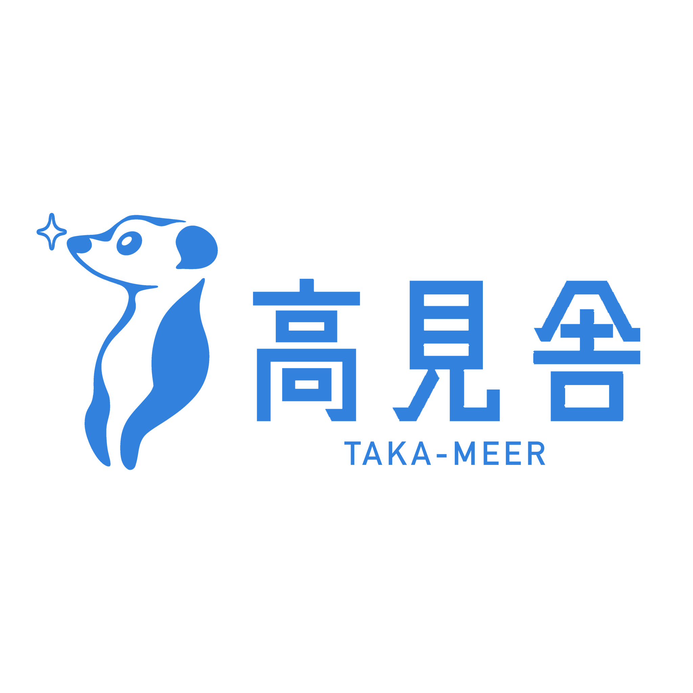
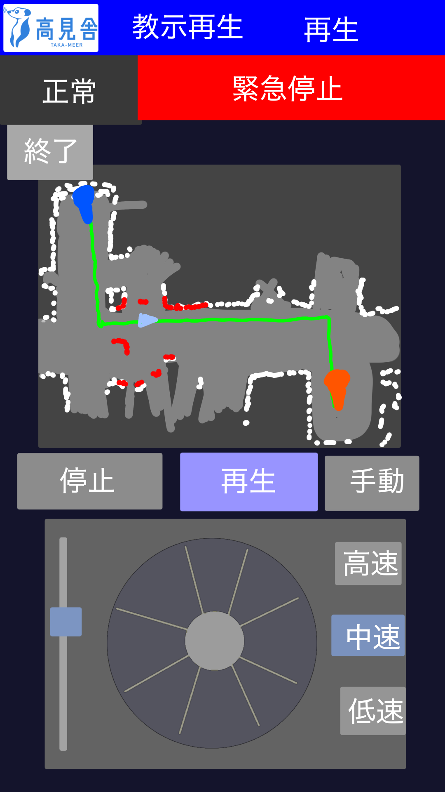
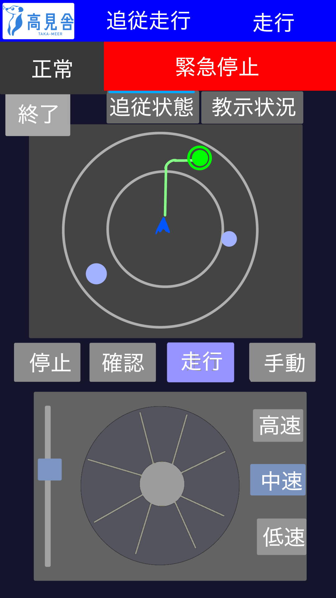

# 新設計

この設計書は配電盤上部確認用ロボットの移動システムについて、簡易的な追従走行試験の結果に基づき再設計する。

この設計書は内容の追記は人の手で行い、ClaudeCodeは提案と指示による整形のみ行う。詳細はAI(基本的にOpus5)が別ファイルに作成する。

## 用語

| 用語 | 意味 |
| --- | --- |
| 機体 | 走行部（CuGoV3 + ESP32 + LiDAR + RaspberryPi4）を載せた車体本体。PC は含まない。 |
| 試験員 | 機体を運用する人。原則 1 人で全作業が完結することを目標にする。 |
| 保管場所 | 機体を置いておく場所。 |
| 試験場 | 配電盤があり、実際の確認作業を行う場所。納品前の製品が置かれている。 |
| 走行方式 | 保管場所⇔試験場の移動を実現する手段の候補。 |
| 教示 | 経路を一度人が走らせて記録すること。記録そのもので移動も達成される。 |
| 教示再生 | 記録済み経路を機体が単独でなぞること。 |
| 盤 | 配電盤。上部をカメラで確認する対象。 |
| カメラ昇降 | 盤上部を見るためにカメラを持ち上げる機構。停止精度の要求元。 |
| 対象（人物） | LiDAR による人物追跡で選択された、追従・呼び寄せの相手。 |
| 必須通信系統 | ESP32・RaspberryPi4(LiDAR)・PC の 3 者間の通信。これ以外は任意。 |

## 目標

1. 人・物への接触 0 件、意図しない挙動 0 件
2. カメラ昇降が要求する許容差内に、手動微調整なしで停止できる
3. 地図作成＋盤登録が試験員1人で完結し、地図の手修正が不要
4. 保管場所⇔試験場を、試験員が付き添う以上の負担なく移動できる
5. 往復＋準備+試験を再起動なしで完走

### 走行方式KPI

全方式共通

| KPI                      | 数値     | 合否の目安                       |
| ------------------------ | -------- | -------------------------------- |
| 完走率                   | 回/回    | 区間を介入なしで走り切れた割合   |
| 人の介入回数             | 回/100 m | 手動介入・E-Stop・リカバリの合計 |
| 経路逸脱（最大横ずれ）   | m        | 通路幅に対して                   |
| 実効平均速度             | m/s      | 記録項目（合否に使わない）       |
| 使い始めるまでの準備時間 | min      | 教示・線の確認・リード接続など   |
| 許可の要否               | 可否     | 足切り                           |

方式固有

| 方式              | 固有 KPI                                                                         |
| ----------------- | -------------------------------------------------------------------------------- |
| 1. 追従走行       | ロスト回数/100 m、ロスト→復帰時間、誤追従（別人・別物）回数、追従距離のばらつき  |
| 2. 手動走行       | 操作者が画面を見ている時間の割合、WiFi 途絶起因の停止回数                        |
| 3-4. 教示（記録） | 記録の完走率、記録に要する時間、やり直し回数                                     |
| 5. 教示再生       | 終点位置誤差 [m]（＝ドリフト）、経路逸脱最大値、障害物遭遇時の挙動               |
| 6. 区画線走行     | 線のロスト率、線が無い／途切れる区間の割合、分岐での判断成功率                   |
| 7. 電子リード走行 | 距離追従誤差、意図しない停止回数、リードの取り回しの実用性（定性）               |

盤前の向きの2方式も同じ枠で比較：平面検出成功率 / 法線誤差 [deg]（2点指示との差分で相対評価できる）/ 押下回数 / 盤が壁と面一のときの挙動。

MVP で残すか切るかの判断順：① 許可 → ② 完走率・介入回数 → ③ 安全（接触0・意図しない発進0）→ ④ MVP 期間内に作れるか。

## 制作の仕方

PoC後のMVP作成期間が短い。

PoC段階で本ソフトウェアは候補の案全部乗せで動くように開発し試験する

MVP開発段階で採用されなかったものを削って行く。

## 設計思想

操作系は **WebUI のみ**。専用アプリ・コマンドライン操作を運用手順に含めない。

## 完成形の使い方

本節は確定した運用手順（What/How）を記す。意思決定の経緯・比較検討・却下案は
[NewVISION.md](NewVISION.md) とその詳細ファイル（`onsite-*.md` / `transit-*.md`）を参照。
両者の内容が食い違う場合は、経緯を持つ `NewVISION.md` 側を先に見直し、本節を合わせる。

### 導入

1. PCでsetup.shを実行
2. 起動(下記参照)し動作確認画面から動作確認を行う。[動作確認システム詳細](NewDesign-operationalCheck.md)
3. キャリブレーション画面を開きキャリブレーションを行う[キャリブレーションシステム詳細](NewDesign-calib.md)

### 起動

1. 保管場所で機体の電源を入れる
2. 機体のWi-FiにPCを接続
3. PCのソフトウェアを起動(start.sh)
4. 各ネットワークデバイスがリンクする。トピックを送り合うなどで正常に通信できていることを自動で確かめる。webUIでそれを確認できるようにする。必須通信系統がなければ動作に移れない。それ以外も接続されていれば正常か、起動しているか確認できる。
5. 一定時間接続できない場合は制御系を再起動する。(細かくは実装をもとに作成するマニュアルを参照する)

### 移動：保管場所⇔試験場（往復共通）

保管場所から試験場への移動と、試験場から保管場所への移動は同じ手順・同じUIで行う（往復で分けない）。

1. 駆動用バッテリー残量を確認する。(低下時警告を出すが出ていないからといって長時間の動作を保証するものではない。走行時間と残量を見て試験員が判断する)
2. PCのソフトウェアのwebUIから複数の走行方法から選択する。
   1. 追従走行　速度改善版
   2. 手動走行  現行のまま
   3. 教示　追従走行
   4. 教示　手動走行
   5. 教示再生走行
   6. 区画線走行
   7. 電子リード走行
3. 試験場まで走行

保管場所以外からは教示はしない。教示再生走行は基本的に保管場所からのみ。できれば経路付近なら復帰できるようにしたい。

教示は何度も使う新規経路ができたとき、物の配置が大きく変わったときにする。

[各走行方法の詳細](NewDesign-transit.md)

### 試験場内の移動と配電盤前

前日の地図作成・盤登録、当日の盤前移動・呼び寄せ、配電盤前での挙動は
[試験場内の移動・配電盤前 詳細](NewDesign-onsite.md) を参照。

### 異常時

異常発生時は画面の上にウィンドウを表示する。解決していなくとも非表示、再表示できる。解決時は自動で閉じ、再開するか問う。再開する場合"はい"で異常発生前のモードに戻る。"いいえ"で停止モードで戻る。できるだけ再開できるように実装するが、再開できないもの、再開先が手動操作の場合は"確認"1択にする。

物理緊急停止ボタンが押されているときは人力搬送モードとみなす。センサ系統は止めず、再開できるようにする。押されているとき、画面には解除方法を案内し解除されたら再開ボタンを表示する。

走行中障害物が現れた際、原則停止する。走行開始時に決定した経路を逸脱しない。

必須通信系統、使用されていたタブレット(接続されていただけは含まない)が切断された場合は停止する。

### 人物追跡

追従走行、位置指定、呼び寄せに使われるLiDARでの人物追跡について。

数秒間一人だけしか認識されない場合は自動でその人を選択。複数人いる場合は勝手に選択しない。

500ms(実際の動作をみて調整)以内のロストは停止しない。それ以上の場合は選択解除、停止する。人物追跡が必要な状態でロストしたとき(していたとき)対象選択、モード選択に被らないように案内ウィンドウを出す。モード選択で不要なモードが選ばれた場合はウィンドウを自動で閉じる。

人物追跡は任意のタイミングで停止できる。必要な画面に入った場合は自動で起動する。起動中は対象選択画面の中心に"起動中"と表示する。

### WebUI

上部にロゴ、プロジェクト名(MIRS2602-高見舎プロジェクト)、画面名称、現在のモード、フォルト表示枠、緊急停止ボタンを配置。これを最上位とし異常時のウィンドウなどがかぶさることはない。緊急停止はどんなときでも動作する。これより上位にくるブラウザの確認ウィンドウなどは使用しない。

PCとタブレットの両方で操作できる。

縦長、横長両対応

例に合わせる必要はない。機能はこれ以上、各要素の大きさはこれの1倍から0.5倍が望ましい。色や形状はより良くする。

#### 主選択画面

ここから各走行方式、準備、試験、動作確認、キャリブレーション、設定に移れる。ネットワーク接続確認はこの画面に表示される。

### WebUI開発モード

開発用の設定を開けるWebUI開発モード。それ以外は通常のものと同じ。

機器が接続されていない、バッテリー電圧が低いといった選択した特定の警告を無視して動作させることができる。暴走する危険を承知の上でこのモードで開く。

選択した特定のログのみをタイムスタンプありで記録する設定をできる。

### その他仕様

* 人の検知などを任意のタイミングで止めれるようにする(処理が相当重くPCが熱くなる)
* 試験場内は納品する製品があるため低速に制限する。試験場内では自動ブレーキオンがデフォルト。
* 重心が高くなることが予想されるので加減速はゆっくり行う。ESP32のファームウェアレベルでモータ出力の急変を抑える。制動距離が長い前提で制御する。

## ハードウェア構成

1. Wi-Fi AP
   全ての機器の通信を中継する。
2. PC
   ほとんどの処理を担う。機体に乗せる必要はなく、有線での接続はしない。
3. ESP32
   CuGoV3(モーターx2、エンコーダx2)、IMU、物理緊急停止ボタンとGPIO接続。PCとWi-Fi接続websoket通信。
4. RaspberryPi4
   LiDARをUSB接続。/scanをパブリッシュする。
5. LiDAR
   RPLIDAR S1 360°全周 256000baud 10Hz
6. IMU
   DSR1603 BNO055 9軸（加速度計＋ジャイロ＋地磁気）
7. CuGoV3
   クローラー DCモーター×2 + エンコーダ×2

## ソフトウェア構成

1. PC
   Ubuntu + Docker + Ubuntu22.04 + ROS2
   (windows+wsl+DockerからUbuntu+Dockerに変更)
2. ESP32
   C++
3. RazuberiPi4
   Ubuntu22.04 + ROS2
