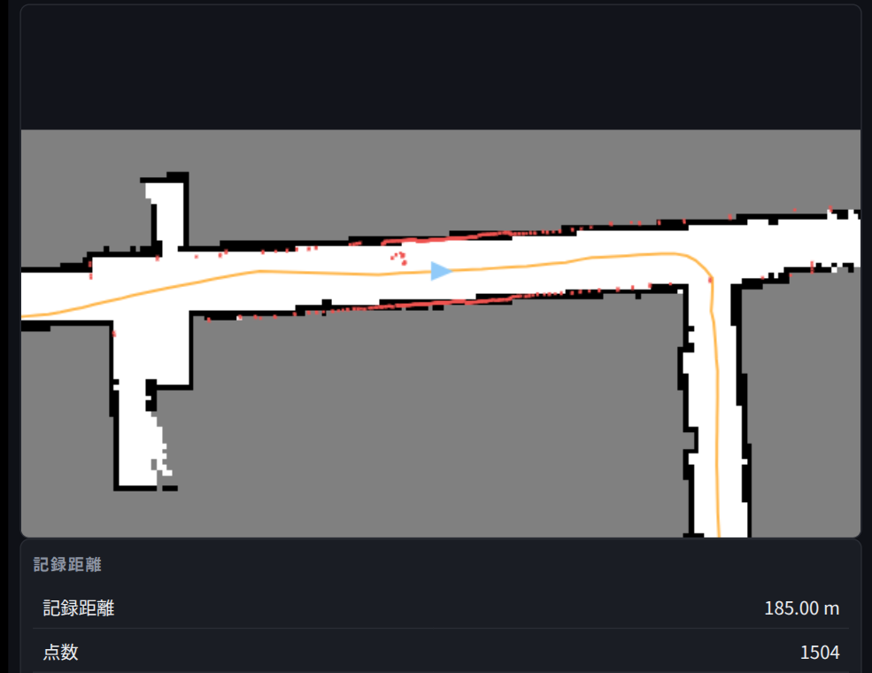
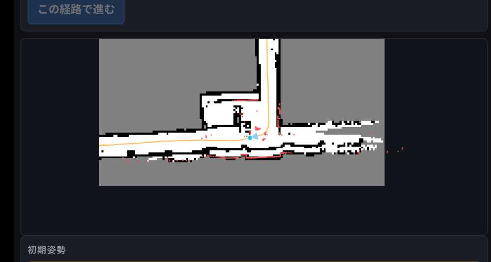
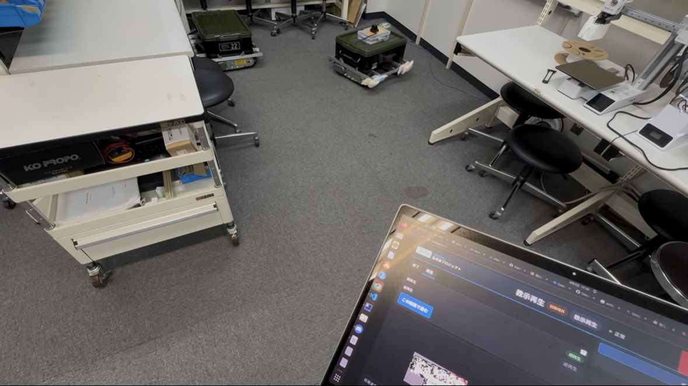
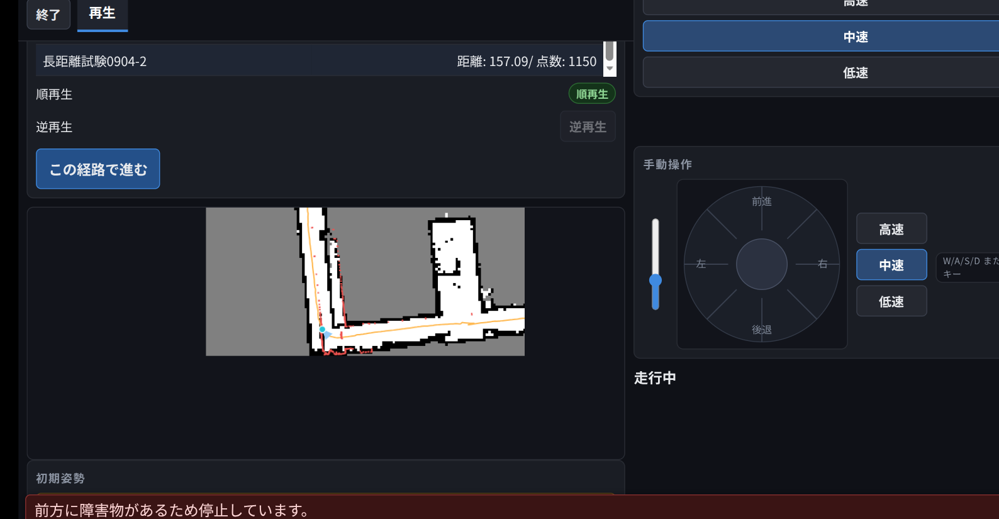

# 教示再生走行試験

[← README に戻る](../README.md)

- 目的: 教示再生が機能するか実用に足るかを検証する

## 試験一覧

| # | 試験 | 実施日 | コース | 結果 | 原因 | 対応 |
| --- | --- | --- | --- | --- | --- | --- |
| 1 | [第1回3階](#1-第1回3階教示再生走行試験) | 2026-09-03 | 校舎3階（約170m） | 地図が再構築され経路が壁に埋まる／開始直後に逆旋回して壁と衝突、復帰不能 | ① `slam_toolbox` のループ閉じ込みで記録済み経路だけ補正前フレームに取り残される　② 別セッションの経路を再生／地図の凍結・再読込の欠陥で自己位置推定が効かないまま走行 | [`6540f4d`](https://github.com/TAKA-MEER/th-system/commit/6540f4d) ほか WS-9K/9L/9M/9N-A/9N-B の一連の修正（詳細は §1） |
| 2 | [第2回3階](#2-第2回3階教示再生走行試験) | 2026-09-04 | 校舎3階（約170m） | 2つ目の曲がり角で自己位置推定に失敗、柱と衝突 | 経路選択のたび同一の `slam_toolbox` へ `deserialize_map` を打ち、地図コピーが積み上がる | [`38ce377`](https://github.com/TAKA-MEER/th-system/commit/38ce377) fix(WS-9S): 経路選択のたび `slam_toolbox` を作り直してから deserialize を1回だけ行う |
| 3 | [短距離](#3-短距離教示再生走行試験) | 2026-09-04 | クリエイティブラボ | 完走。障害物のすぐ近くを衝突せず通過 | — | — |
| 4 | [第3回3階](#4-第3回3階教示再生走行試験) | 2026-09-04 | 校舎3階（約170m） | 3つ目の曲がり角で自己位置推定に失敗、壁と衝突 | ① IMU（ジャイロ）未融合が主因　② 廊下でのSLAM補正パラメータが弱い（二次要因）　③ 経路データ自体の段差 | [`6e39f71`](https://github.com/TAKA-MEER/th-system/commit/6e39f71) feat(WS-9V): `imu_enabled` 既定を true に／[`8ebce6f`](https://github.com/TAKA-MEER/th-system/commit/8ebce6f) feat(WS-9W): SLAM補正パラメータをWebUIから調整可能に |

> 「対応」列は本試験の考察をもとに同日中〜翌未明に入った修正（`feat/demo-teach-replay` ブランチ）。
> 第1回・第2回・第3回3階試験とも、次に3階コースで再走行して効果を確認する試験がまだ行われていない
> （§5 参照）。

---

## 1 第1回3階教示再生走行試験

- 実施日: 2026年9月3日
- 実施体制: 1名でロボットの起動・手動教示・教示再生開始・見守り・記録

### 1.1 試験条件

| 項目 | 内容 |
| --- | --- |
| コース | 校舎3階（約170m） |
| 走行モード | 手動走行（教示）1周 → 教示再生走行 1周 |
| 環境 | 屋内（3階フロア） |

### 1.2 結果

- 地図の作成には成功。人の写り込みもなし。経路も正しく取れていそうだった
- 1周まわったことで蓄積されたズレを修正するため地図が再構築され、一部経路が壁に埋まった
- **教示再生は全く機能しなかった。** 開始直後に逆方向へ旋回し壁と衝突、復帰不能に



### 1.3 考察

自動保存された `.wip`（185.0m / 1504点 / 包絡 44.5×56.4m）を解析した結果:

> 記録点は通常0.12m間隔なのに、index 1474→1475 で1サンプルの間に **4.09m・yaw −6.3° 跳んでいる**。
> 0.1秒で4m動くことはあり得ず、`slam_toolbox` が**ループを閉じてポーズグラフを最適化した瞬間**。
> 補正は現在の自己位置には効くが、それ以前に記録した1474点は補正前のフレームのまま残り、地図だけが
> 補正後のフレームで再構築される。これが「一部経路が壁の中に入った」の正体（§1.2 2点目）。
>
> また、1周の経路は保存されず `.wip` だけが残っており、再生では**別の起動セッションで記録した経路**
> （`start_yaw` −178.1°）を選んでしまっていた。地図は起動ごとに作り直されるため座標が無意味になり、
> 約180°旋回してから壁へ向かった（§1.2「開始直後に逆方向へ旋回」の直接原因）。

（`5d4bc24` docs、2026-09-03 12:40 の初動診断より）

### 1.4 対応

第1回の試験後（2026-09-03 12:40〜2026-09-04 01:01、`feat/demo-teach-replay` ブランチ）に、
上記2つの原因とその周辺を修正した。

**① ループ閉じ込みで記録済み経路が補正前フレームに取り残される**

- [`6540f4d`](https://github.com/TAKA-MEER/th-system/commit/6540f4d) fix(slam): ループ閉じ込みを無効化
  （`do_loop_closing: false`）し、記録済み経路の破壊を防ぐ

**② 別セッションの経路を再生してしまう／教示の保存が信用できない**

- [`42fba68`](https://github.com/TAKA-MEER/th-system/commit/42fba68) feat(WS-9K-B): 経路に地図セッション
  ID を付け、別セッションの経路を再生させない
- [`8d98e0e`](https://github.com/TAKA-MEER/th-system/commit/8d98e0e) fix(WS-9K-D): 教示中にモードが教示系
  から出たら自動保存して記録を閉じる
- [`a5f57a6`](https://github.com/TAKA-MEER/th-system/commit/a5f57a6) feat(WS-9K-E2): `RouteStatus` に
  `saved` を追加し、保存成功時にだけ「保存しました」を出す（保存失敗時の偽陽性表示をやめる）

**③ 再生前に地図を正しく凍結・読み直す仕組みが無かった**

- [`c184f4a`](https://github.com/TAKA-MEER/th-system/commit/c184f4a) /
  [`f107679`](https://github.com/TAKA-MEER/th-system/commit/f107679) /
  [`b907ea2`](https://github.com/TAKA-MEER/th-system/commit/b907ea2) feat(WS-9L): 教示「保存」で地図を
  凍結保存し、再生前に読み直す `/map_session/open` を新設
- [`e14fdb5`](https://github.com/TAKA-MEER/th-system/commit/e14fdb5) /
  [`c433f36`](https://github.com/TAKA-MEER/th-system/commit/c433f36) /
  [`bb5b645`](https://github.com/TAKA-MEER/th-system/commit/bb5b645) fix(WS-9M): 上記実装の不具合3件を
  修正（拡張子重複で読み直しが常に失敗／一時停止状態の追跡ミス／失敗を検知できず「読み直した」と
  誤報告）。**この時点まで再生は地図を一度も読み直せておらず、自己位置補正の無いデッドレコニングで
  走っていた**

**④ SLAMノードが「地図凍結＋自己位置推定継続」に対応していなかった（開始直後の姿勢ズレの直接原因）**

- [`f2f4fd8`](https://github.com/TAKA-MEER/th-system/commit/f2f4fd8) WS-9N-A: 再生の READY で自己位置が
  経路の始点から1.52m/41.8°ずれ走り出すと発散する欠陥（再生中も地図作成が走り続けていた）を断つため、
  SLAMノードを `map_and_localization_slam_toolbox_node` に差し替え
- [`1dc9403`](https://github.com/TAKA-MEER/th-system/commit/1dc9403) /
  [`ea25a87`](https://github.com/TAKA-MEER/th-system/commit/ea25a87) /
  [`be25977`](https://github.com/TAKA-MEER/th-system/commit/be25977) /
  [`22d29bc`](https://github.com/TAKA-MEER/th-system/commit/22d29bc) feat(WS-9N-B):
  `set_localization_mode` で地図を凍結し、経路の始点姿勢を渡して `LOCALIZE_AT_POSE`
  で自己位置推定するよう配線
- [`fec43f8`](https://github.com/TAKA-MEER/th-system/commit/fec43f8) docs(WS-9N-B): 上記をマニュアル・
  VISION に反映

**その他（同じ実機セッションで見つかった副次的な不具合）**

- [`14e55a2`](https://github.com/TAKA-MEER/th-system/commit/14e55a2) fix(WS-9J-A): 起動直後のログ洪水
  （1Hz サマリが8割を占め、本当の警告が埋もれる）を止める
- [`00d912a`](https://github.com/TAKA-MEER/th-system/commit/00d912a) fix(WS-9J-B): 起動直後の未受信を
  「途絶」と誤検知し毎回 ESTOP に落ちる不具合を修正
- [`0e5e09b`](https://github.com/TAKA-MEER/th-system/commit/0e5e09b) fix(WS-9J-C): `slam_params.yaml`
  に LiDAR の実機最小レンジ（0.2m）を明示

④ は本試験の「開始直後に逆方向へ旋回」を最も直接に説明する（始点で40°超の姿勢ズレがあれば、
最初の目標点への旋回方向自体が誤る）。①〜④ とも 3階コースでの再走行による効果確認はまだ
行われていない（§5）。

---

## 2 第2回3階教示再生走行試験

- 実施日: 2026年9月4日
- 実施体制: 2名でロボットの起動・手動教示・教示再生開始・見守り・記録

### 2.1 試験条件

| 項目 | 内容 |
| --- | --- |
| コース | 校舎3階（約170m） |
| 走行モード | 手動走行（教示）1周 → 教示再生走行 1周 |
| 環境 | 屋内（3階フロア） |

### 2.2 結果

2つ目の曲がり角で自己位置推定に失敗。柱と衝突。



### 2.3 考察

ログの解析を行った Claude Code によると:

> ディスク上の地図ファイルは再生で上書きされていない。`/root/th_data/routes/長距離試験0904-1.posegraph`
> の更新時刻は教示保存時（06:55:41）のまま。再生を回した後も変わっていない。「上書き」に見えているのは
> WebUI が表示している `/map` トピックの中身。
>
> 教示保存の時点で mapping→localization に切り替わってはいる。`slam_toolbox` のノードログ:
>
> ```txt
> 06:47:11  Enabling mapping ...      ← 起動
> 06:55:41  Enabling localization ... ← 教示「保存」で凍結
> ```
>
> `/slam_control/last_result` も OK: 「地図を読み直しました（地図を凍結して自己位置推定に切り替えました）」
> を出していて、再生の読み直しパス自体は完走している。
>
> **教示にも使っている長寿命の `slam_toolbox` ノード1個に対して、経路選択のたび `deserialize_map` を
> 打っている。** deserialize は既存グラフをクリアせず上乗せするので、地図コピーが積み上がり、
> `LOCALIZE_AT_POSE` のスキャンマッチが二重地図の誤コピーに食いつく。`LOCALIZE_AT_POSE` の
> deserialize は本来「まっさらなノードで起動時に1回」やる操作。
>
> 加えて実装上の穴: `DeserializePoseGraph` の応答は空、`slam_toolbox` 2.6.10 はこのノードで
> deserialize のログを一切出さない、`slam_control._handle_map_reload` は結果を検証せず必ず
> 「地図を読み直しました」と返す。→ **黙って壊れても成功表示になる。**

### 2.4 対応

reload のたび `slam_toolbox` を respawn してから deserialize を1回だけ行うよう変更
（`38ce377` fix(WS-9S)、2026-09-04）。

---

## 3 短距離教示再生走行試験

3階試験の前後に動作確認として行っていた試験。教示再生の精度を表す。

- 実施日: 2026年9月4日
- 実施体制: 1名でロボットの起動・手動教示・教示再生開始・見守り・記録

### 3.1 試験条件

| 項目 | 内容 |
| --- | --- |
| コース | クリエイティブラボの2班ブース前から直進し5班ブース内を1周、5班ブースを出て部屋中央の扉前で停止 |
| 走行モード | 手動走行（教示）→ 教示再生走行 |
| 環境 | 屋内（クリエイティブラボ） |

### 3.2 結果

完走。物のすぐ近くを通るように教示したが、教示再生ではぶつからずに物のすぐ近くを走行した。



---

## 4 第3回3階教示再生走行試験

- 実施日: 2026年9月4日
- 実施体制: 1名でロボットの起動・手動教示・教示再生開始・見守り・記録

### 4.1 試験条件

| 項目 | 内容 |
| --- | --- |
| コース | 校舎3階（約170m） |
| 走行モード | 手動走行（教示）1周 → 教示再生走行 1周 |
| 環境 | 屋内（3階フロア） |

### 4.2 結果

3つ目の曲がり角で自己位置推定に失敗。壁と衝突。



### 4.3 考察

ログの解析を行った Claude Code によると:

> 自己位置がずれる主因は「IMU（ジャイロ）を融合していない」こと。廊下の特徴量不足は二次的な要因。
>
> **実機で確認したこと**
>
> 1. **IMU が使える状態なのに OFF になっている（主因）**
>    - bringup 起動引数: `imu_enabled` 無し → `ekf_params_no_imu.yaml`（エンコーダのみ）
>    - `/esp32/imu_data` は 10Hz で配信中、`/esp32/imu_calib_status = 48` → gyro キャリブレーション = 3
>      （完全）。EKF はジャイロの `vyaw` だけ使うので mag/accel が 0 でも問題ない
>    - `ekf_params.yaml`（IMU 版）の `imu0:` 欠落バグは 2026-09-02 に修正済み、`imu0_config` は
>      `vyaw` のみ融合する正しい設定
>    - ジャイロの dps→rad/s 変換も `imu.cpp` で修正済み（2026-08-06）
>    - つまり IMU 融合の準備は全部整っているのに、`imu_enabled:=true` を渡していないだけ
>    - クローラは超信地旋回でトラックが滑り、エンコーダだけだと L字コーナーの旋回で yaw が
>      大きくずれる（`docs/architecture.md` が「超信地旋回時のクローラースリップによる yaw ドリフト」
>      と明記）。コーナーでずれた向きのまま次の廊下に入る → 特徴の無い廊下では横方向の誤差が
>      そのまま伸びる → スクショの「壁と scan がずれる」→ `obstacle_limiter` が停止
> 2. **廊下での SLAM 補正が弱い（二次要因・原理的限界）**
>    - `correlation_search_space_dimension: 0.5` — スキャンマッチの探索窓が ±0.5m。コーナーで
>      0.5m 以上ずれると真の一致が窓の外 → 誤った局所解にロック
>    - `link_match_minimum_response_fine: 0.1` — 弱い一致も受理。廊下では一致がどれも弱いので、
>      廊下軸方向にずれた位置に食いつきうる
>    - `minimum_travel_distance: 0.3` — 0.3m 進むごとにしか補正しない
>    - 特徴の無い長い廊下は SLAM/localization の原理的な弱点（廊下軸方向に拘束が無い）。IMU を
>      入れても完全には消えない
> 3. **経路データ自身にも段差**
>    - `長距離試験0904-2.json`（1150点）は420点目で1.12mの不連続がある（教示中のscan-match補正の
>      痕跡。この経路もエンコーダのみで教示された）。再生時、その付近で経路と地図が局所的に食い違う

### 4.4 対応

- IMU 融合（①）: `imu_enabled` の既定を `true` に変更（`6e39f71` feat(WS-9V)、2026-09-04）
- SLAM補正パラメータ（②）: 既定値を調整（`minimum_travel_distance` 0.3→0.2、`minimum_travel_heading`
  0.3→0.25、`correlation_search_space_dimension` 0.5→0.8）に加え、WebUI（メインメニュー →
  「保守・設定」→「設定」→「一般」タブ）から現場で追加調整できるようにした
  （`8ebce6f` feat(WS-9W)、`98d7e3a`/`6360317` feat(WS-9X)、2026-09-04）
- 経路データの段差（③）: 未対応。エンコーダのみで教示した古い経路（`長距離試験0904-2`）に限る事象。
  IMU 融合後に教示し直せば解消する見込みだが未検証

---

## 5 総括と今後の試験

3階コースでの試験（第1回・第2回・第3回3階試験）は3回とも自己位置推定の失敗による衝突が発生し、
唯一クリエイティブラボの短距離試験だけが完走した。3回とも見つかった原因はいずれも
`feat/demo-teach-replay` ブランチ上で修正済み（上表・各回の「対応」参照）。

**未実施・提案**:

- **3階コース（約170m）での再試験（第4回3階教示再生走行試験）。** 今回まとまった一連の修正
  （第1回: ループ閉じ込み無効化・WS-9K/9L/9Mのセッション整合と地図凍結再読込・
  WS-9N-A/9N-B の SLAM ノード差し替え／第2回: WS-9S 地図読み直し／
  第3回: WS-9V IMU既定ON・WS-9W/9X SLAM補正パラメータ調整可）を、
  実際にこの症状が出ていたコースで通しで検証できていない。特に、曲がり角で自己位置推定が
  外れて壁・柱と衝突する事象（3回とも共通）が再発しないかを重点確認する
- **経路データの段差（4.3 ③）への対応。** IMU 融合を有効にした状態で教示を撮り直し、
  同じ長距離経路で段差が解消するか確認する
- 別セッションで実機作業中に見つかった **長距離再生時の `replay_runner` クラッシュ**
  （再入 spin による異常終了）も、本試験の範囲外だが同時期に修正済み
  （`9d27c44` fix(WS-9U)、2026-09-04）。次回試験で長距離経路を扱う際はここも対象にできる
