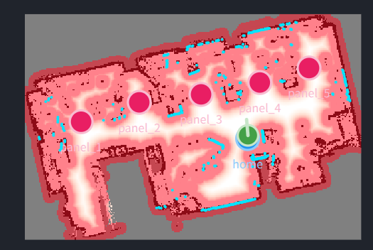

# 試験場内動作試験

[← README に戻る](../README.md)

- 目的: 試験場内動作（フェーズ2。前日準備・当日の配電盤移動・呼び寄せ・安全機能）が
  実現可能か、実用に足るかを検証する

## 試験一覧

| # | 試験 | 実施日 | 会場 | 結果 | 原因 | 対応 |
| --- | --- | --- | --- | --- | --- | --- |
| 1 | [第1回](#1-第1回試験場内動作試験) | 2026-09-14 | クリエイティブラボ（5ブースを配電盤に見立てた） | **前日準備、当日の配電盤5箇所全巡回＋待機場所復帰、障害物/人物回避、呼び寄せまで通しで動作を確認。** 中断導線（BLOCKED時）・走行中の物理非常停止・壁近接警告は今回の会場条件・時間の都合で未検証 | — | 次回、意図的な難所配置（狭所・壁際登録）と、走行中の非常停止を追加検証する |
| 2 | [第2回](#2-第2回試験場内動作試験) | 2026-09-14 | 1箇所のみ（地点1相当。地点2・3は未整備） | **ピン登録3方式（いまの姿勢で登録／2点指示／地図タップ）の比較。** 当日中に地図タップ方式を新規実装し実機投入。3方式ともTier0（`BLOCKED`回避・到達）は達成。登録誤差は姿勢が最も正確（1.4cm/0.05°）、2点指示・タップはほぼ同水準（16〜17cm/1〜5°、n=1〜2） | 地点2（狭所）・地点3（人混み）を用意できず方式固有の弱点検証は未実施 | 次回、地点2・3を用意して方式固有の弱点（機体の取り回し・人物追跡の頑健性）を検証する |

詳しい試験項目・合格条件は [試験項目.md](試験項目.md) を参照。

---

## 1 第1回試験場内動作試験

- 実施日: 2026年9月14日
- 会場: クリエイティブラボ（5つのブースを配電盤 `panel_1`〜`panel_5` に見立てた）
- ブランチ: `feat/demo-teach-replay`（`stage:=4`）

### 1.1 試験条件

| 項目 | 内容 |
| --- | --- |
| 会場 | クリエイティブラボ。5ブースを配電盤5箇所に見立てた |
| ピン登録方式 | **5箇所すべて「いまの姿勢で登録」を使用**（2点指示は今回未使用） |
| 起動 | `stage:=4`。N-27（起動時ESTOP）は発生せず、「解除」操作も不要だった |

### 1.2 実施の流れと結果

実際には5つの区間に分かれる。

**A. 前日準備 一連（T-1・T-2・T-3・T-3b）— 3分55秒**

地図作成開始 → panel_1〜5を順に**「いまの姿勢で登録」** → 登録完了後、S-20の
**「1ボタンで待機場所に戻す」**で自律移動 → **「保存」**、までを一連で実施。
**壁近接警告は一度も出なかった**（会場の配電盤役がいずれも壁から十分離れていたため、
警告条件に該当しなかったとみられる。2点指示方式は今回未使用）。内訳（地図作成・各登録・
復帰・保存それぞれの所要時間）は分割計測していない。

**B. 当日 全盤前巡回 一連（T-4・T-5・T-6・T-10）— 5分11秒**

会場地図の読み直し → 「宣言する」（**ズレ警告なし**） → panel_1→panel_2→panel_3→
panel_4→panel_5 と**5箇所すべてに1回ずつ順番に自動移動して到着** → 最後に「待機場所」を
選んで自動復帰、までを止めずに通した。**5箇所とも `AT_PANEL` に到達し、途中で `BLOCKED`
や停止は発生しなかった**（このBでは障害物・人物による意図的な妨害試験は行っていない、
素の巡回）。各箇所の到着位置・向きについて、操作者の印象では**「全箇所とも大きくずれて
いない」**（定性的な印象であり、数値の実測はしていない）。

このBの最後の「待機場所」への復帰は、当日画面（S-21）の「行き先」タブから選ぶ経路であり、
Aの「1ボタンで待機場所に戻す」（前日準備S-20側の機能）とは別の経路を通っている。両方が
機能したことになる。

**C. panel_2 単体の到着精度 実測（T-6追加）— 40秒**

Bとは別に、待機場所→panel_2 を単独で再実行し、到着精度を実測した。
**到着時間 40秒／到着位置のズレ 7cm／向きのズレ 4°。**

**D. panel_1 への移動中に安全機能試験（T-7・T-12）**

待機場所→panel_1 への自律移動を開始し、以下を連続して実施。**すべて衝突なし。**

1. 進路に人が飛び出す → 自動停止 → 人が退避 → 自動再開
2. 少し進んだ先で段ボール障害物を設置 → `BLOCKED` → 撤去 →
   **自動で再計算・再開**（停止から接触までの余裕 約30cm、退けてから再開まで約1.5秒、
   「再検索」の手動操作は不要=0回）
3. 再開した**直後にもう一度**同じ段ボール障害物を設置（二重BLOCKED） → 再度自動停止
4. panel_1 へ到着（このときの到着精度は、安全機能の確認に注意が向いていたため
   **良くも悪くも印象に残っておらず**、数値・所感とも記録なし）

過去に実機で見つかっていた「障害物を退けても永久にBLOCKEDのまま」というバグは、今回の
条件では再現しなかった。再開直後の再ブロックという厳しめの条件でも自動再開の仕組みは
機能した。

**E. 空いている場所で呼び寄せ・対象選び直しの簡易確認（T-9・T-11）**

簡易的な動作確認を実施。退避待ち → 自動発進の流れ、および対象の選び直しは**いずれも
正常に動作**したが、詳細な時間計測・再現性の記録は取っていない。

**物理非常停止ボタン（T-13）**: 動作試験を始める前に押下し、システムが認識して非常停止
状態に入ることを確認した。**自律移動中に押した場合の即時停止・解除後の復帰動線は今回は
確認していない。**

**気づき**: panel_1 への移動経路上、中心に1本足がある丸椅子のすぐ近くを通過した際、
LiDARの設置高では脚部分しか見えていなかった。接触はなかったが、余裕距離は未計測。
背の高い/上部が張り出した什器では、この理屈で細く見える可能性がある。

### 1.3 未検証（今回対象外とした項目）

- **T-8（中断導線）**: `BLOCKED` からの「中断して待機場所へ」— D で自動再開が確認できたため、
  長時間 `BLOCKED` が続く状況を意図的に作らず未実施
- **壁近接警告の実発生**（T-3の一部）: 会場の配電盤役が壁から十分離れていたため、警告が
  出る条件を作れなかった。2点指示方式そのものの成立確認も未実施
- **走行中の物理非常停止ボタン**（T-13の一部）: 静止状態での押下確認のみ
- **panel_1・3・4・5の到着精度の実測**: 到達自体はB（全盤前巡回）で確認したが、数値実測が
  あるのはpanel_2（C）のみ。panel_1到着時（D）は安全機能試験に注意が向いており印象も残っていない

### 1.4 考察・次回への持ち越し

- **今回の会場条件では、フェーズ2の主要経路がほぼすべて通しで、事故なく動作した。**
  前日準備の一連（地図作成→5箇所登録→前日側の待機場所復帰→保存）、当日の一連
  （読み直し→宣言→5箇所全巡回→当日画面からの待機場所復帰）、障害物/人物回避、
  呼び寄せ・対象選び直しまで、実機での通し検証が一度もできていなかった状態から
  実現可能性を示せた。
- 一方で、**安全機能の中でも「動いている最中に非常停止ボタンを押す」という最も基本的な
  確認が今回は取れていない**。次回最優先で実施する。
- `BLOCKED` からの中断導線・壁近接警告の実発生は、いずれも「起きなかった／作らなかった」
  だけで、機能自体を否定する結果は出ていない。次回、意図的にこれらの条件（塞ぐ配置・
  壁際登録）を作って確認する。
- 到着精度の数値実測は今回panel_2の1件のみ。次回、複数箇所で実測を取り、ばらつきの
  傾向を見たい。
- 丸椅子の脚のような細い什器への接近余裕は目視評価のみだったため、次回は実測を伴う
  接近試験を検討する。

---

## 2 第2回試験場内動作試験

- 実施日: 2026年9月14日
- 会場: 1箇所のみ（地点1相当・開けた場所。狭所・人混みを想定した地点2・3は用意できず未実施）
- ブランチ: `feat/demo-teach-replay`（`stage:=4`）
- テーマ: **ピン登録方式の比較**（いまの姿勢で登録／2点指示／地図タップ）。詳しい試験計画は
  [試験項目.md](試験項目.md) を参照

### 2.1 試験条件

| 項目 | 内容 |
| --- | --- |
| 比較した方式 | いまの姿勢で登録（`ROBOT_POSE`）／2点指示（`TWO_POINT`）／**地図タップ（`MAP_TAP`、当日新規実装）** |
| 地図タップとは | WebUIの地図をタップして位置・向きを直接指定する第3の登録方式。試験当日に実装し、その日のうちに実機投入した（[Spec-onsite.md](plan/spec/Spec-onsite.md) §3.7） |
| 起動 | `stage:=4`。N-27（起動時ESTOP）は発生せず、「解除」操作も不要だった |
| 会場の制約 | 地点2（狭所）・地点3（人混み）を用意できず、**方式固有の弱点検証（機体の取り回し・人物追跡の頑健性）は今回対象外** |

### 2.2 実施の流れと結果

**A. 地図タップ方式の実装・実機投入・不具合修正 — 当日中**

試験当日に地図タップ方式（バックエンド・WebUI双方）を実装し、実機のタブレットで動作確認した。
確認の過程で2件の不具合を発見しその場で修正した:

1. **タブレットでピンチズームができない**（地図拡大の手段が元々無かった）
2. **タップした位置と実際に登録される位置がずれる**（`--stage-scale`で画面全体を拡大する
   構成と、座標変換に使っていた`getScreenCTM()`の組み合わせに起因すると見られる）

いずれも実機で再現・修正・再確認済み（e2e回帰テストも追加）。壁近接時の即時拒否・警告表示は
修正後の実機確認で正常動作を確認した。

**B. 3方式比較（旧手順・停止位置ベース） — 地点1、3方式×3回**

各方式で登録 → 自律移動 → 停止位置と印のズレを実測、を3方式×3回ずつ実施。

| 方式 | 位置誤差[cm]（平均・SD） | 向き誤差[°]（平均・SD） | 登録時間 | 拒否/やり直し |
| --- | --- | --- | --- | --- |
| いまの姿勢で登録 | 12.0・≈1.0 | 7.0・0 | 110秒 | 0回 |
| 2点指示 | 28.7・≈1.2 | 7.0・0 | 90秒 | 0回 |
| 地図タップ | 27.0・≈2.6 | 3.7・≈1.5 | 85秒（ズーム操作込み） | 1回 |

3方式ともTier0（`BLOCKED`にならず`AT_PANEL`到達、3回中3回成功）は達成。**ただし位置誤差は
3方式とも一貫して大きく、原因は登録方式の精度ではなくNav2の到達誤差
（`xy_goal_tolerance`=±0.25m）を「停止位置」という指標が含んでしまっていたためと判明した
（後述C・D）。**

**C. 登録誤差だけを分離する測定法の発見 — 地図タップの登録2回目**

登録プロセス自体の再現性を見るため地図タップを2回目登録した際、そのピンを削除せず残して
おいたところ、**ロボット本体を印の位置へ物理的に置いて`map→base_link`のTFを読む**ことで、
Nav2を介さずに「印の真の座標」を直接得られることに気づいた。この方法で地図タップの
登録誤差（Nav2を介さない値）を分離すると**位置9.6cm・向き7.1°**となり、Bの27cm・3.7°とは
大きく違う値になった（27cmとの差・約17cmはNav2の到達誤差でおおむね説明がつく）。

**D. 3方式を1セッションで比較（新手順・登録誤差ベース） — 地点1、1回ずつ**

Cで見つけた測定法を標準化し、同じ印にロボットを置いてTFで真の座標を記録した上で、
3方式とも削除せずに登録（`panel_1`〜`3`として自動採番）、それぞれの登録誤差を算出した。

| 方式 | 登録座標 | 登録誤差・位置 | 登録誤差・向き |
| --- | --- | --- | --- |
| いまの姿勢で登録（`panel_3`） | x=-18.272, y=0.256, yaw=-4.47° | **1.4cm** | **0.05°** |
| 2点指示（`panel_2`） | x=-18.441, y=0.274, yaw=-5.96° | **15.8cm** | **1.44°** |
| 地図タップ（`panel_1`） | x=-18.195, y=0.410, yaw=0.0° | **17.1cm** | **4.52°** |

（真の座標: x=-18.283, y=0.264, yaw=-4.52°、TF実測）

### 2.3 方式比較のまとめ

**精度（登録誤差、参考値。n=1〜2で確定的な傾向ではない）**

| | いまの姿勢で登録 | 2点指示 | 地図タップ |
| --- | --- | --- | --- |
| 位置誤差 | **1.4cm**（D） | 15.8cm（D） | 17.1cm（D）／9.6cm（C、別試行） |
| 向き誤差 | **0.05°**（D） | 1.44°（D） | 4.52°（D）／7.1°（C、別試行） |
| 人物追跡への依存 | 無し | 有り（ロスト中は登録拒否） | 無し |

今回は「いまの姿勢で登録」が圧倒的に正確だった。ただし地点1（開けた場所）のみでの結果で
あり、地点2（狭所）では姿勢の不利、地点3（人混み）では2点指示の不利が出る設計だったが
未検証（§2.4）。

**登録作業（時間・難易度）**

| | いまの姿勢で登録 | 2点指示 | 地図タップ |
| --- | --- | --- | --- |
| 登録時間（B、1回あたり） | **110秒（最長）** | 90秒 | **85秒（最短）** |
| 操作 | 機体をジョグ等で目標位置・向きへ物理的に移動させ、その場で登録 | 試験員が立ち位置→一歩寄った位置の2点を押下 | タブレット画面を見ながらタップ＋ドラッグ |
| 機体を動かす必要 | **有り**（登録のたびに機体を目標地点まで運ぶ） | 無し | 無し |
| 人が動く必要 | 無し | **有り**（試験員が現地で2点分移動） | 無し（画面操作のみ） |
| 拒否・やり直し | 0回 | 0回 | 1回（原因未特定） |

登録時間は姿勢が最長・タップが最短という結果になったが、**姿勢の110秒には機体を目標地点まで
運ぶ移動時間が含まれる**ため、単純な操作の速さの比較ではない。

**前日準備の負担という観点（先方要望）**

先方から「前日準備の負担を減らしたい」との要望がある。今回の結果を踏まえると:

- **地図タップは機体も人も動かす必要がなく**、タブレット画面の前にいるだけで全ての盤を
  登録できる。盤数が多いほど、機体を物理的に運ぶ姿勢や、試験員が現地を歩く2点指示より
  身体的な負担・移動時間を削減できる可能性がある。
- **いまの姿勢で登録は盤の数だけ機体を運ぶ必要があり**、盤数が多い会場では前日準備の
  所要時間が延びると見られる（今回は地点1のみでの計測のため、複数盤での実測ではない）。
- 2点指示は人物追跡の可用性・対象選択の手間が前提として乗る。
- ただし地図タップは当日実装したばかりで、実機投入時に2件の不具合（A参照）が見つかった
  ように、まだ枯れていない。前日準備の負担軽減という利点と、実装の成熟度は分けて評価する
  必要がある。

### 2.4 未検証（今回対象外とした項目）

- **地点2（狭所）・地点3（人混み）**: 会場を用意できず、方式固有の弱点
  （姿勢の機体取り回し・2点指示の人物追跡頑健性）の検証は次回に持ち越し
- **T-6/T-6b（2点指示のステップ距離・地図タップのズーム操作と精度の相関）**: 時間の都合で未実施
- **カメラ昇降が要求する精度（`O-a1`）との突き合わせ**: 今回測った登録誤差は参考値として
  記録したのみで、実用可否の判定には使っていない（`O-a1`はシステム全体がもっと完成してから
  見えてくる性質のものと判断。[試験項目.md](試験項目.md) §2.1参照）

### 2.5 考察・次回への持ち越し

- **実用ラインの設定自体を2回見直した。** 当初は「停止位置と印のズレ10cm以下」を合否基準に
  していたが、①この10cmの根拠が前回実測1件だけだったこと、②3方式とも一貫して超過し
  「停止位置」という指標がNav2の到達誤差を含んでしまっていたことが分かり、「登録座標と印の
  ズレ」（Nav2を介さない登録誤差）に切り替えた。さらに検討を進め、**カメラ昇降の要求精度が
  今は確定できない以上、cm/°の絶対合否ラインを置くこと自体をやめ、実用可否はTier0
  （`BLOCKED`回避・到達）のみで判定し、精度は3方式比較のための参考値として記録する**方針に
  落ち着いた。数値を先に決めて後から根拠を継ぎ足すより、素直に「参考値として蓄積する」と
  割り切った方が誠実という判断。
- **「ロボットを印に置いてTFを読む」という測定法は、次回以降も使える資産になった。**
  メジャー・分度器で壁や基準線から測る方式は、地図座標系のどこを原点に取ればよいか
  分かりにくく実施が難しかったが、ロボット自身の自己位置を使えば基準点の変換が一切不要になる。
- **3方式の精度差は地点1（開けた場所）だけでは判断材料が薄い。** 姿勢が今回圧倒的に
  正確だったが、地点2（狭所）で機体の取り回しが悪化すれば逆転する可能性がある。次回、
  地点2・3を用意して本来の比較（方式固有の弱点が出る条件）を行う。
- **前日準備の負担軽減という観点では、地図タップが理論上もっとも有利**（機体・人とも
  動かさない）。ただし実装したばかりで細かい不具合が実機で初めて見つかったばかりであり、
  もう数回実機で使ってから枯れ具合を含めて再評価したい。
- 登録誤差の実測はまだn=1〜2の方式が多い。次回、同一方式で複数回・複数地点の実測を
  積み増し、ばらつきの傾向を見たい。
