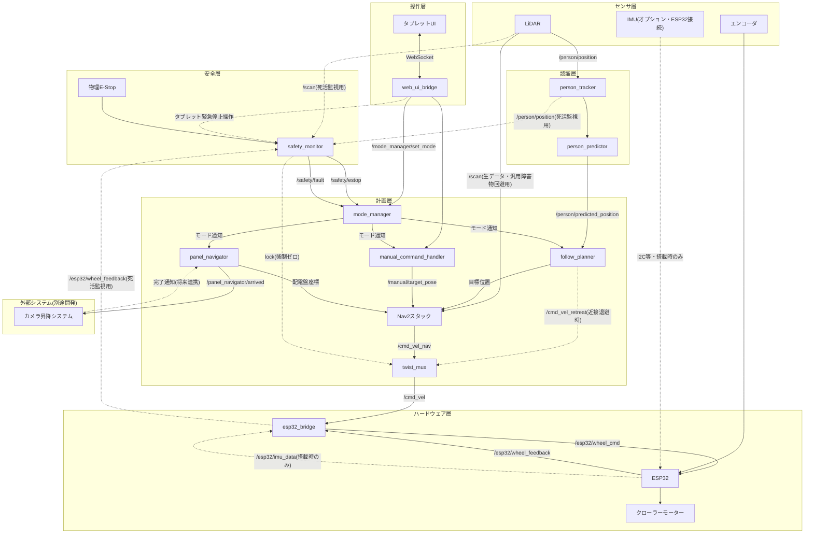
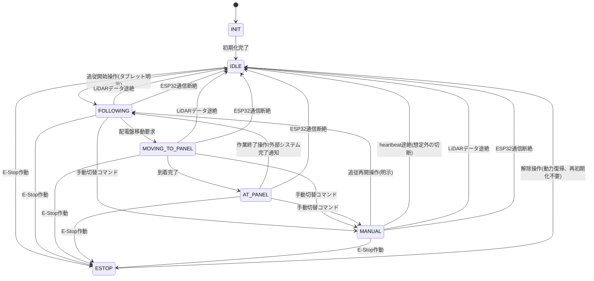
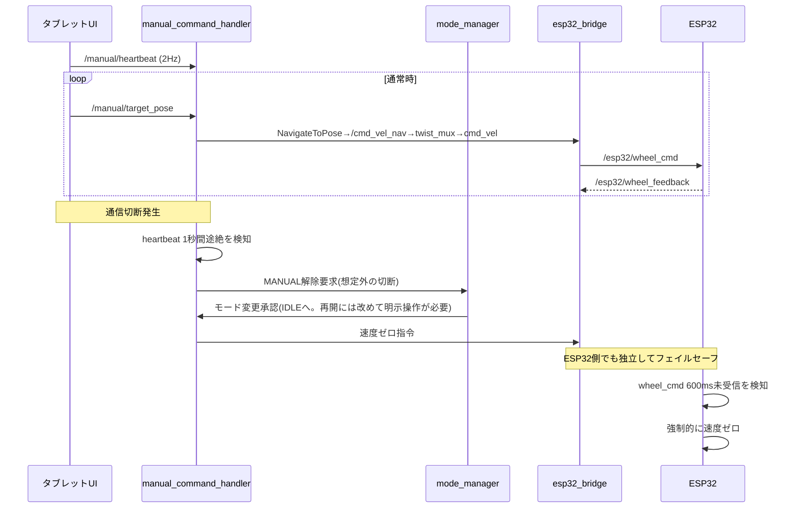

# THシステム 移動機構 詳細設計書

## 1. はじめに

本書は、配電盤上部確認用ロボットの移動機構について、初期設計書で指摘された課題を踏まえた完全な設計を提案するものです。Docker + Ubuntu 22.04 + ROS2 Humble環境を前提とします。

---

## 2. システムアーキテクチャ

### 2.1 ノード一覧

| ノード名                          | 役割                                                                   | 言語(推奨)                                       |
| --------------------------------- | ---------------------------------------------------------------------- | ------------------------------------------------ |
| `person_tracker`                | LiDARから試験員の相対位置(x,y)を取得(既存実装と連携)                   | Python/C++                                       |
| `person_predictor`              | LiDARロスト時にオドメトリ+簡易SLAMで試験員位置を予測                   | Python                                           |
| `mode_manager`                  | システム全体の状態遷移管理(FSM)                                        | C++                                              |
| `follow_planner`                | 試験員位置から追従目標位置を算出(近接時の後退判断を含む)               | Python                                           |
| `panel_navigator`               | 配電盤前への移動目標を管理                                             | Python                                           |
| `nav2`スタック(既存パッケージ)  | 経路計画・障害物回避・局所制御                                         | -                                                |
| `twist_mux`(ROS2標準パッケージ) | 複数の`/cmd_vel`発行元の優先度制御・排他多重化、E-Stopロック         | -                                                |
| `manual_command_handler`        | タブレットからの操作コマンドを解釈                                     | Python                                           |
| `web_ui_bridge`                 | タブレットブラウザ⇔ROS2間通信(rosbridge)                              | -                                                |
| `esp32_bridge`                  | ESP32との通信(WebSocket, PC側がサーバー)                               | Python(`esp32_bridge`側)・Arduino/C++(ESP32側) |
| `safety_monitor`                | E-Stop監視に加え、LiDAR・ESP32の死活監視によるフェイルセーフ検知を担う | C++                                              |

### 2.2 主要トピック/サービス/アクション

| 名前                                      | 型                                                                                        | 概要                                                                                                                                                                                  |
| ----------------------------------------- | ----------------------------------------------------------------------------------------- | ------------------------------------------------------------------------------------------------------------------------------------------------------------------------------------- |
| `/person/position`                      | `geometry_msgs/PointStamped`                                                            | LiDARによる試験員相対位置(既存実装出力)                                                                                                                                               |
| `/scan`                                 | `sensor_msgs/LaserScan`                                                                 | LiDAR生スキャンデータ。Nav2 costmapの障害物レイヤーへ直接入力し、試験員かどうかを問わず周辺物体全般への衝突回避に使用(4.3.8節)                                                        |
| `/person/predicted_position`            | `geometry_msgs/PointStamped`                                                            | ロスト時の予測位置                                                                                                                                                                    |
| `/robot/mode`                           | カスタム`RobotMode.msg`                                                                 | 現在の動作モード                                                                                                                                                                      |
| `/mode_manager/set_mode`                | サービス                                                                                  | モード変更要求                                                                                                                                                                        |
| `/manual/target_pose`                   | `geometry_msgs/PoseStamped` (frame: base_link)                                          | 手動入力によるロボット基準目標座標                                                                                                                                                    |
| `/manual/heartbeat`                     | `std_msgs/Empty`                                                                        | タブレットUIからの生存信号                                                                                                                                                            |
| `/safety/estop`                         | `std_msgs/Bool`                                                                         | 非常停止フラグ(物理ボタン・タブレットの緊急停止ボタンを`safety_monitor`が集約)                                                                                                      |
| `/safety/fault`                         | カスタム`FaultStatus.msg` (active, fault_type: `LIDAR_LOST`/`ESP32_DISCONNECTED`等) | `safety_monitor`がLiDAR(`/person/position`・`/scan`)やESP32(`/esp32/wheel_feedback`)の途絶を検知した際のフォルト通知。`twist_mux`のロックと`mode_manager`への通知を兼ねる |
| `/esp32/wheel_cmd`                      | カスタム`WheelCommand.msg` (left_speed, right_speed)                                    | 左右クローラー目標速度                                                                                                                                                                |
| `/esp32/wheel_feedback`                 | カスタム`WheelFeedback.msg`                                                             | 左右クローラー実速度                                                                                                                                                                  |
| `/cmd_vel_nav`                          | `geometry_msgs/Twist`                                                                   | Nav2 controller_serverの出力(通常の自律走行・手動ゴール移動・配電盤移動すべてで共用)。`twist_mux`の入力の1つ                                                                        |
| `/cmd_vel_retreat`                      | `geometry_msgs/Twist`                                                                   | `follow_planner`からの近接退避時の直接速度指令(4.3.7節)。`twist_mux`の入力の1つ                                                                                                   |
| `/cmd_vel_manual`(将来)                 | `geometry_msgs/Twist`                                                                   | 将来のジョイスティック的な連続手動操作用(5.2節)。`twist_mux`の入力として予約                                                                                                        |
| `/cmd_vel`                              | `geometry_msgs/Twist`                                                                   | `twist_mux`が優先度に基づき選択した最終速度指令。`esp32_bridge`へ入力される唯一の経路(2.4節)                                                                                      |
| `/panel_navigator/go_to_panel`          | サービス(panel_id指定)                                                                    | 配電盤前への移動要求                                                                                                                                                                  |
| `/panel_navigator/arrived`              | カスタム`PanelArrival.msg` (panel_id)                                                   | 配電盤到着通知(外部のカメラ昇降システムへ)                                                                                                                                            |
| `/panel_navigator/complete_inspection`  | サービス                                                                                  | 作業完了通知(タブレット操作、または将来的に外部システムからも呼び出し可)                                                                                                              |
| `/panel_navigator/at_panel_interrupted` | カスタムメッセージ(panel_id)                                                              | `AT_PANEL`から`MANUAL`へ中断する際の外部カメラ昇降システムへの通知(仮称)                                                                                                          |
| `/esp32/imu_data`                       | `sensor_msgs/Imu`                                                                       | IMUデータ(IMU搭載時のみ発行。未搭載時はトピック自体が存在しない)                                                                                                                      |
| `NavigateToPose`                        | Nav2標準アクション                                                                        | 経路計画・実行(追従/手動/配電盤移動すべてで共用)                                                                                                                                      |

すべてのカスタムメッセージは `th_system_msgs` パッケージに集約し、インターフェース変更の影響範囲を一箇所で管理する。

なお `imu_enabled` はトピックではなくROS2起動パラメータ(bool)で、IMUの有無によって `esp32_bridge` とlocalization設定(6.3節参照)の挙動を切り替えるために使用する。

### 2.3 ノード構成図

IMUはESP32に直接接続するセンサとして位置づけ、ROS2側(`esp32_bridge`以降)には「搭載時のみデータが流れる」インターフェースとして見せる。これにより、IMUの調達待ちでも他の開発(追従ロジック、モード管理、手動操作等)を並行して進められる(詳細は6.3節)。

### 2.4 速度指令の排他制御(`twist_mux`)

`/cmd_vel` の発行元は、Nav2(通常の自律走行・手動ゴール移動・配電盤移動)、`follow_planner`(近接時の緊急退避、4.3.7節)、将来のジョイスティック手動操作(5.2節)と複数存在する。これらを個々のノードの内部状態管理だけで排他制御すると、タイミングのずれによる競合や、安全停止が正しく最優先されない実装ミスのリスクがある。そこでROS2標準パッケージの `twist_mux` を導入し、ハードウェアへの最終出力 `/cmd_vel` を一箇所に集約・優先度制御する。

**優先度設定(暫定):**

| 優先度 | 入力トピック                                      | 発行元                                             | 用途                                                                                                                     |
| ------ | ------------------------------------------------- | -------------------------------------------------- | ------------------------------------------------------------------------------------------------------------------------ |
| 最優先 | lock(`/safety/estop`・`/safety/fault`の2系統) | `safety_monitor`                                 | E-Stop時、およびLiDAR/ESP32フォルト検知時の強制ゼロ出力。他のどの入力よりも優先し、`twist_mux`の標準機能として保証する |
| 高     | `/cmd_vel_manual`(将来)                         | `manual_command_handler`(ジョイスティック実装時) | 手動連続操作。操作者の意図を最優先する                                                                                   |
| 中     | `/cmd_vel_retreat`                              | `follow_planner`                                 | 近接時の緊急退避(4.3.7節)                                                                                                |
| 低     | `/cmd_vel_nav`                                  | Nav2 controller_server                             | 通常の自律走行全般(追従・手動ゴール移動・配電盤移動)                                                                     |

- 各入力トピックには `twist_mux` のタイムアウト設定(例: 0.5秒未受信で非アクティブ扱い)を行い、発行元が停止している入力は自動的にミューティングされるようにする。
- `safety_monitor` は `/safety/estop` が立った場合に加え、LiDARやESP32のデータ途絶を検知した場合(`/safety/fault`)にも、`twist_mux` のlock機構を通じて出力を強制的にゼロにする。これにより、`mode_manager`のモード遷移処理を待たずに、フォルト検知と同時に物理的な動きを止めることができる(モード遷移自体はその後追って行われ、`IDLE`等への移行と復帰の明示操作要求を担う)。Nav2や`follow_planner`など他のどの発行元からの指令よりも確実に停止が優先されることを、アプリケーションロジックではなく`twist_mux`の標準機能として保証する(7.1節参照)。
- なお `twist_mux` は「最終的にハードウェアへ渡す`/cmd_vel`の調停」のみを担当する。「どのノードが現在Nav2の`NavigateToPose`アクションクライアントとして有効か」という上位の排他制御は、引き続き `mode_manager` のモード管理(3章)が担う。両者は役割の異なるレイヤーであり、互いを代替するものではない。
- `follow_planner` の近接退避(4.3.7節)は `FOLLOWING`/`MOVING_TO_PANEL` モード中のみ `mode_manager` からのモード通知を見て作動し、`MANUAL` 中は意図的に作動させない(操作者がタブレット操作のためロボットの近くにいることは想定内であり、ここで退避が作動すると手動操作と常に競合してしまうため)。`MANUAL` 中の安全性はNav2標準の障害物回避(4.3.8節)で担保する。

---

## 3. 状態管理(モード管理)

### 3.1 状態一覧

- **INIT**: 起動時の初期化中
- **IDLE**: 待機状態(動かない、観測のみ)。起動直後はここで待機し、明示的な開始操作があるまで自動では動き出さない
- **FOLLOWING**: 試験員自動追従モード
- **MOVING_TO_PANEL**: 配電盤前へ自動移動中
- **AT_PANEL**: 配電盤前到着後の作業モード。現状はその場で静止し、外部のカメラ昇降システムに作業を委ねる(将来的にはカメラの向きを基準とした直感的な移動を実装予定)
- **MANUAL**: 手動操作モード
- **ESTOP**: 非常停止状態(最優先)

### 3.2 遷移ルール

- `ESTOP` へはどの状態からでも即座に遷移可能、かつ最優先で割り込む。解除時は再初期化不要のため `IDLE` へ直接復帰する(物理E-Stopは動力遮断のみで演算系は継続動作するため、`INIT` からやり直す必要はない)。
- `INIT` 完了後は安全のため自動では動き出さず、必ず `IDLE` を経由する。`IDLE → FOLLOWING` は試験員によるタブレット上の明示的な「追従開始」操作によってのみ遷移する。起動直後に意図せず動き出すことを防ぐための方針。
- `MANUAL` への遷移はタブレットからの明示的な切替コマンドでのみ発生し、`FOLLOWING`/`MOVING_TO_PANEL`/`AT_PANEL` を中断する。
- `MANUAL` 終了時の遷移先は理由によって分ける。
  - 試験員が明示的に「追従再開」操作を行った場合 → `FOLLOWING` へ復帰する(能動的な操作の結果なので、動き出しても想定の範囲内)
  - heartbeat途絶など想定外の通信切断によるタイムアウトの場合 → `IDLE` へ遷移する(安全側に倒し、再開には改めて明示操作を要求する)
- `MOVING_TO_PANEL` はタブレット操作(将来的には音声指示等)をトリガーとし、到着後は自動的に `AT_PANEL` へ遷移する。
- `AT_PANEL` から `FOLLOWING` への復帰は、タブレットの「作業終了」操作、または将来的に外部のカメラ昇降システムからの完了通知(`/panel_navigator/complete_inspection`)のいずれかで発生する。
- LiDARデータ(`/person/position`または`/scan`)が途絶した場合は、`FOLLOWING`/`MOVING_TO_PANEL`/`MANUAL` のいずれの状態からでも `IDLE` へ遷移する。検知は`safety_monitor`が行い、`/safety/fault`により`twist_mux`を即座にロックして物理的な動きをまず止めた上で、`mode_manager`に通知してモードを遷移させる(7.1/7.2節)。`/scan` はNav2の障害物回避にも使われており(4.3.8節)、LiDAR途絶は試験員追従だけでなく衝突回避そのものが機能しなくなる安全上の問題であるため、手動操作中であっても継続を許可しない。復帰にも明示操作を要求し、起動時と同じ安全方針に統一する。
- ESP32との通信が途絶した場合(ハードウェアリセット・電圧降下等を含む)は、`FOLLOWING`/`MOVING_TO_PANEL`/`MANUAL`/`AT_PANEL` のいずれの状態からでも `IDLE` へ遷移する。検知はESP32側ウォッチドッグ(ハードウェア層、即時)と`safety_monitor`(ROS2層、`/safety/fault`によるtwist_muxロックと`mode_manager`への通知)の二重で行う。WebSocketクライアントの自動再接続(6.2節)により通信自体は自動復旧するが、ハードウェアリセットは想定外の事象であるため、他の異常と同様に復帰には明示操作を要求し、自動では`FOLLOWING`等へ戻さない。
- `mode_manager` はサービス `/mode_manager/set_mode` でモード変更要求を受け付け、現在の状態と要求元の優先度に基づき許可/拒否を判定する。

### 3.3 状態遷移図

ESTOPはどの状態からも最優先で割り込む。また `IDLE → FOLLOWING` は常に明示操作を要求し(起動直後・LiDAR途絶からの復帰のいずれも)、ロボットが操作者の予期しないタイミングで動き出すことがないように統一している。

---

## 4. 試験員追従システム

### 4.1 入力

`/person/position` を既存のLiDAR測位ノードから取得する。検出の信頼度や「検出ロスト」を明示的に通知するフラグを既存実装側に追加してもらうことを推奨する(現状はロスト判定の手段が設計書になく、これがないと4.2のロジックが成立しない)。

### 4.2 ロスト時の予測(`person_predictor`)

- 直近の試験員位置履歴(例: 過去2秒分)から速度ベクトルを推定し、ロスト後は等速直線運動モデルで予測位置を外挿する。
- 予測継続時間に上限を設定する(例: 5秒、または予測位置の不確実性が一定閾値を超えたら打ち切り)。
- 予測打ち切り後は「捜索行動」へ移行する。具体案は以下の2つで、現場検証で決定する。
  - その場で緩やかに旋回しLiDAR視野を広げる
  - 最後の既知位置付近まで移動し再検出を試みる
- 自己位置のドリフト抑制のため、`slam_toolbox` 等による軽量な簡易SLAMで局所的な自己位置補正を行う。

### 4.3 追従目標位置の算出(`follow_planner`)

使用感に直結する最重要パラメータのため、優先順位と具体アルゴリズムを詳細に定義する。

#### 4.3.1 位置決定の優先順位

目標位置は以下の優先順位で決定し、上位の制約を満たした上で下位を最適化する。

1. **近接時の緊急回避(最優先・安全)**: 試験員またはそれ以外の人物・障害物が異常接近した場合は、視野角維持や快適性よりも優先してその場の安全行動(後退・停止)を取る。試験員本人への対応は4.3.7節の専用ロジック、それ以外への対応は4.3.8節のNav2標準回避が担当し、最終的な出力調停は2.4節の`twist_mux`が行う。
2. **LiDAR視野角内に試験員を収める(必須制約)**: これが破られると追従システム自体が成立しなくなるため、1.の安全行動以外の何よりも優先する。
3. **試験員との衝突を避ける最低距離を確保する(安全制約)**
4. **試験員の邪魔にならない(快適性の最適化)**: 通行の妨げにならない、作業スペースを侵さない

#### 4.3.2 前提として確認が必要な事項

現状、ロボット搭載LiDARの仕様(取付位置、有効視野角、ロボット筐体自体による死角の有無)が未確定であり、これによって追従位置の取りうる範囲が変わる。本設計ではパラメータ `lidar_fov_deg`(有効視野角)と `lidar_blind_angle_ranges`(死角の角度範囲)を設定可能にしておき、機種・取付位置が確定次第チューニングする想定とする(360度型でほぼ死角がないか、特定方向に限定されるかで4.3.3のロジックの挙動が変わる)。

#### 4.3.3 通常追従時(試験員が移動中)の位置決定

| パラメータ名                 | 説明                                                 | 初期値(暫定)  |
| ---------------------------- | ---------------------------------------------------- | ------------- |
| `follow_distance_target`   | 追従目標距離                                         | 1.5 m         |
| `follow_distance_min`      | 最小許容距離(これより近いと減速・停止)               | 0.8 m         |
| `follow_distance_max`      | 最大許容距離(これを超えると追従速度を上げる)         | 3.0 m         |
| `follow_angle_offset_deg`  | 試験員進行方向に対する追従角度オフセット(0度=真後ろ) | 0〜30度(可変) |
| `corridor_width_threshold` | この幅未満の通路では真後ろ追従に切替                 | 1.5 m         |

**アルゴリズム:**

1. 試験員の移動方向ベクトルを直近の位置履歴(例: 過去1秒)から推定する。静止中は直前の移動方向を保持する。
2. Nav2のlocal costmapを参照し、ロボット周辺の自由空間幅を評価する。
   - 通路幅が `corridor_width_threshold` 未満 → **真後ろ追従**(`follow_angle_offset_deg = 0`)を選択する。配電盤が並ぶ狭い通路を主用途として想定し、これを基本動作とする。
   - 通路幅が十分にある(開けた空間) → **斜め後方追従**(`follow_angle_offset_deg` を最大30度程度まで広げる)とし、試験員の視界に入りやすくコミュニケーションを取りやすい位置にする。
3. 算出した角度オフセットの結果、ロボットから見た試験員の相対角度が `lidar_fov_deg`(死角を除く)を超える場合は、4.3.1の優先順位に従ってオフセットを縮小し、最終的には `follow_angle_offset_deg = 0` まで戻す(視野角確保を最優先)。
4. 試験員との距離が `follow_distance_min` を下回ったら減速・停止、`follow_distance_max` を超えたら追従速度を上げる。

#### 4.3.4 試験員が停止(作業中)した場合の位置決定

試験員の速度が閾値以下の状態が一定時間(例: 2秒)継続したら「静止」と判定し、専用ロジックに切り替える。単純に通常追従位置(真後ろ1.5m等)でそのまま止まると、試験員が配電盤前で作業する際の前方・側方の作業スペースに干渉する可能性が高いため、以下を行う。

1. 試験員の正面方向(作業対象である配電盤がある方向)を避け、背面〜側面方向に位置するよう候補点を再探索する。
2. Nav2のlocal costmapから周囲の自由空間を評価し、通路を塞がない位置(壁際・通路端・退避スペース)を優先する。
3. 試験員を中心に放射状の候補点を複数生成し、「視野角内に収まる」かつ「作業スペースを侵さない」候補の中から、移動コストが最小の点をコスト関数で選択する。
4. 試験員が再び動き出したら、4.3.3の通常追従ロジックに復帰する。

#### 4.3.5 死角への回り込み対策(将来拡張)

通路の曲がり角などで試験員が物陰に入り視野角外に出そうな場面では、ロスト確定前に「先回り」的な位置補正(進行方向の延長線上、曲がり角の手前で視野を確保しやすい位置への移動)を行う余地がある。ただし実装難易度が高いため、初期実装では4.2節の予測・外挿ロジックで対応し、現場検証の結果を踏まえて第2フェーズの拡張機能として検討する(TBD)。

#### 4.3.6 経路送出

- `follow_planner` は算出した目標位置(ロボット相対座標)を、現在のロボット自己位置(map座標系)を用いてmap座標系に変換した上で、Nav2の `NavigateToPose` アクションへ渡す。座標変換の責務はゴールを送信するノード自身が持つ方針とし、5.3節の `manual_command_handler` も同じ方針に統一する。
- 経路計画・障害物回避はNav2に委譲する(独自実装はしない)。
- 目標位置は高頻度(5〜10Hz)で更新されるため、ゴールのハンチングを防ぐデッドゾーン(例: 30cm以上動かない限り再送しない)を設ける。

#### 4.3.7 近接時の後退動作

試験員(または障害物)に近づきすぎた場合、あるいは試験員がロボットに向かって接近してくる場合に、停止だけでなく後退して距離を確保する動作を組み込む。

クローラー駆動車両は非ホロノミック(その場での真横移動ができない)であり、緊急時に取りうる行動は実質的に「前進」「後退」「その場旋回」の3つに限られる。本ロジックはこの制約を前提に設計する。

| パラメータ名                 | 説明                                                                | 初期値(暫定) |
| ---------------------------- | ------------------------------------------------------------------- | ------------ |
| `retreat_trigger_distance` | この距離を下回ったら後退を開始(`follow_distance_min`と同値が基本) | 0.8 m        |
| `retreat_release_distance` | この距離まで離れたら後退を解除し通常追従に戻す                      | 1.2 m        |
| `closing_speed_threshold`  | この接近速度を超えたら、距離に余裕があっても予防的に後退を開始      | 0.3 m/s      |
| `retreat_check_clearance`  | 後退を実行するために退避方向に必要な最小自由空間                    | 0.5 m        |

**アルゴリズム:**

1. `follow_planner` は試験員との相対距離に加え、相対速度(接近しているか、その速さ)を常時計算する。
2. 以下のいずれかを満たしたら「近接退避」状態に入る。
   - 試験員との距離が `retreat_trigger_distance` を下回った
   - 試験員のロボットへの接近速度が `closing_speed_threshold` を超えた(距離自体に余裕があっても、接近速度が速ければ反応が間に合わない可能性があるため予防的に作動させる)
3. **退避方向の決定**: 「ロボット後方」に固定するのではなく、試験員の現在の相対位置ベクトルを基準に、その逆方向(試験員から直接遠ざかる方向)を都度計算する。通常追従中(4.3.3)は試験員がおおむねロボット前方にいるため結果的に後退方向と一致することが多いが、斜め後方追従中や、試験員がロボットの横・後方に回り込んだ場合は単純な後退にならない点に注意する。
4. 算出した退避方向についてNav2のlocal costmapを参照し、`retreat_check_clearance` 以上の自由空間があるか確認する。
   - **自由空間がある場合**: その方向へ退避動作を実行する(詳細は5.の指令方式)。
   - **自由空間がない場合**(壁際・狭所等で退避できない): 退避はせずその場で完全停止する。タブレットUIに「退避不可・停止中」の警告を表示し、試験員に状況を伝える(音声・ランプ等のフィードバックは将来拡張、現状はTBD)。
5. **指令方式**: 反応速度と安全性を両立するため、この退避動作はNav2の `NavigateToPose`(経路計画込みの通常ゴール到達)を経由せず、`follow_planner` から `/cmd_vel_retreat` へ退避方向の速度を直接指令する専用パスで実行する。`NavigateToPose` 経由だと、コントローラの設定によっては「旋回してから前進」という遠回りな動作になり得て、退避動作中に試験員がLiDAR視野角外に出てしまい、4.3.1の最優先制約(視野角確保)自体を一時的に破る恐れがあるためである。ただし安全確認(3.のcostmap自由空間チェック)は必ず経由させ、Nav2の経路計画機能のみを迂回する設計とする。`/cmd_vel_retreat` と、Nav2が並行して出力し続ける `/cmd_vel_nav` との最終的な調停は `twist_mux`(2.4節)が行うため、`follow_planner` 自身がNav2側のゴール送出を止める必要はない(Nav2は通常ゴールへ向け計算を継続してよいが、出力は`twist_mux`によって無視される)。
6. 試験員との距離が `retreat_release_distance` を上回り、かつ接近速度も閾値を下回ったら近接退避状態を解除し、`/cmd_vel_retreat` の発行を停止する。`twist_mux`のタイムアウト設定により当該入力が自動的に非アクティブ扱いとなり、4.3.3の通常追従ロジック(`/cmd_vel_nav`経由)の出力に自然に切り替わる。トリガー距離と解除距離をあえて分けることで、前進・後退を細かく繰り返すハンチングを防止する。
7. **4.3.4(静止時の再配置)との優先順位**: `follow_planner` は毎周期、まず本節の近接退避条件を判定し、該当する場合は4.3.3/4.3.4の通常ロジックより優先して退避動作を実行する。該当しない場合にのみ4.3.3/4.3.4の評価に進む処理順序とする。これにより、試験員が静止して4.3.4の再配置中であっても、近接退避の条件を満たした瞬間にそちらへ切り替わる。
8. **作動モードの限定**: 本節の近接退避ロジックは `mode_manager` からのモード通知を見て、`FOLLOWING`/`MOVING_TO_PANEL` 中のみ作動する。`MANUAL` 中は意図的に無効化する(操作者がタブレット操作のためロボット付近にいることは想定内であり、ここで作動すると手動操作と常に競合してしまうため)。`MANUAL` 中の安全性はNav2標準の障害物回避(4.3.8節)で担保する。`AT_PANEL` 中も移動を伴うため無効化する(4.4節参照)。

#### 4.3.8 試験員以外の人物・障害物への衝突回避

現場には試験員以外の人物が存在しうるが、それらを個別に人物として識別・追跡する必要はない。代わりに、以下の方針で「識別はしないが衝突は避ける」を実現する。

既存のLiDAR測位実装からは、試験員の相対位置(`/person/position`)に加えて生スキャンデータ(`/scan`)も取得できる見込みであることを確認している。これを前提に以下を設計する。

- `/scan` を `person_tracker` とは別系統で、Nav2のlocal costmapの障害物レイヤーへ直接入力する。これにより、検出された物体が試験員であるか、それ以外の人物であるか、単なる物であるかを問わず、ロボット周辺のすべての物体が動的障害物としてNav2の標準的な障害物回避(costmapに基づくローカルプランナーのリアルタイム再計画)の対象になる。
- つまり「試験員の追従目標位置を決める層(`follow_planner`、4.3.1〜4.3.7)」と「あらゆる近接物体との衝突を避ける層(Nav2 costmap + local planner)」を明確に分離する。試験員の識別結果は前者にのみ使い、後者はセンサの生データだけで動作するため、試験員以外の人物に対しても識別不要で衝突回避が機能する。
- 人物は静的障害物と異なり予測しづらい動きをするため、costmapのinflation layer(膨張半径)を通常の静的障害物より広めに設定することを推奨する。
- ローカルプランナー(例: Regulated Pure Pursuit Controller等)は、前方に物体が急接近した場合に停止だけでなく後退を含む回避行動を取れるよう、後退速度・後退距離を有効化したパラメータ設定にしておく。
- 初期実装では人物専用の高度な動的障害物レイヤー(速度を考慮したsocial navigation的な拡張)までは導入せず、まずは標準のcostmap+inflationで運用し、現場での挙動検証を踏まえて必要性を判断する(TBD)。

**4.3.7(試験員への退避)との役割分担と競合解消:**

- 試験員本人への対応は4.3.7の専用ロジック(`/cmd_vel_retreat`)が担当し、試験員以外の人物・障害物への対応は本節のNav2標準回避(`/cmd_vel_nav`)が担当する、という役割分担にする。
- 両者の最終的な調停は2.4節の `twist_mux` が優先度に基づいて行うため、`follow_planner` やNav2自身が「相手が動いているかどうか」を意識して制御を譲り合う必要はない。それぞれが自分の役割に応じた速度を計算して出力し続けるだけでよく、ハードウェアへの最終出力は常に`twist_mux`の優先度設定(`/cmd_vel_retreat` > `/cmd_vel_nav`)に従う。
- 4.3.7の自由空間チェック(同節4.)は本節のcostmap(`/scan`由来)をそのまま参照するため、試験員と第三者が同時に接近しているような状況でも、退避方向の安全性判定には両方の障害物情報が反映される。
- 試験員自身が近接していない状態で第三者のみが急接近した場合は、4.3.7は作動せず(`/cmd_vel_retreat`が発行されない)、Nav2標準回避(`/cmd_vel_nav`、本節)のみで対応する。

### 4.4 配電盤前への移動と到着後の動作(`panel_navigator`)

- 配電盤の座標は事前作成した地図上に登録する(複数ある場合はIDで管理)。
- 移動トリガーは未定とのことなので、暫定的にタブレットUIの「配電盤Xへ移動」ボタンとし、`/panel_navigator/go_to_panel` サービス(panel_id指定)として抽象化しておくことで、将来音声指示等への差し替えを容易にする。
- 到着後は `mode_manager` に通知し、`AT_PANEL` モードへ遷移する。

**AT_PANELモードでの動作:**

- 配電盤前への到着完了と同時に `/panel_navigator/arrived` を発行し、別システムであるカメラ昇降システムに作業開始のタイミングを通知する(両システムの結合点)。
- 現状の実装範囲では、`AT_PANEL` 中はその場で静止する。`panel_navigator`がNav2ゴールをキャンセルすることで`/cmd_vel_nav`の出力が止まり、4.3.7の近接退避も本モードでは無効化されている(4.3.7節8.)ため、`twist_mux`の入力がいずれも非アクティブとなり、タイムアウトにより最終出力`/cmd_vel`もゼロになる。
- 将来的には「カメラの向きを基準とした直感的な移動」(例: タブレットでカメラ映像を見ながら、見たい方向に微調整移動する操作)を実装予定とのことなので、今回の設計段階では以下の点だけ拡張に備えておく。
  - `AT_PANEL` 用のトピック名前空間(`/panel_mode/...`)を予約し、将来この名前空間に専用の移動ハンドラノード(例: `panel_relative_motion_handler`)を追加できるようにする。
  - `AT_PANEL` 中の移動も最終的には4.3節と同じくNav2の `NavigateToPose` を経由させる構成とし、障害物回避ロジックを使い回せるようにする。
- 作業終了は、タブレットの「作業終了」操作、または将来的に外部のカメラ昇降システムから `/panel_navigator/complete_inspection` を呼び出すことでも遷移できるよう、サービスとして抽象化しておく(現状はタブレット操作のみ運用)。
- 外部システムとの結合インターフェース(`/panel_navigator/arrived` のメッセージ内容、完了通知のタイミング等)は、カメラ昇降システム側の詳細設計と合わせて確定する必要がある(TBD)。

**AT_PANEL中の安全性に関する留意点:**

- AT_PANEL中はカメラ昇降システムが基準とするロボット位置を動かさないことが望ましいため、4.3.7/4.3.8の「移動を伴う」回避ロジックはAT_PANEL中はあえて無効化する(動くと撮影位置がずれてしまうため)。そのため、この間の衝突安全性は基本的に物理E-Stopおよび試験員自身の注意に依存する設計になる。
- 最低限の対策として、`/scan` を用いた近接検知のみは継続し、一定距離(例: 0.3m)以内に物体が検知された場合はタブレットUIに警告表示を行う(ロボット自体は動かさない)ことを推奨する。
- どこまでの安全機構が必要かは、外部のカメラ昇降システム側の安全設計と合わせて確定する(TBD)。

**AT_PANELからMANUALへ中断する場合の外部システム連携:**

- AT_PANEL中にカメラ昇降システムが作業中(例: カメラ昇降動作中)に、タブレットから `MANUAL` への切替が行われると、ロボットが動いてしまい外部システム側の安全(機構の損傷・転倒等)に影響する可能性がある。
- これを踏まえ、`AT_PANEL → MANUAL` への遷移時には `/panel_navigator/at_panel_interrupted` (仮称)を発行し、外部システムに作業中断を通知する設計とする。この通知を「遷移前に外部システムからの中断可否応答を待つ同期確認」にするか、「通知のみ行い遷移は即座に許可する非同期通知」にするかは、外部システム側の安全要件と合わせて決定する(TBD)。

---

## 5. 手動操作システム

### 5.1 通信方式

- `rosbridge_suite`(WebSocket)+ `roslibjs` を用い、タブレットブラウザから直接ROS2トピック/サービスを操作する構成とする。
- UIはWebアプリ(React等)とし、将来専用ポインティングデバイスに置き換える際もrosbridge経由のインターフェースは変更不要にする。
- `/manual/heartbeat` を一定周期(例: 2Hz)で送信させ、`manual_command_handler` が一定時間(例: 1秒)受信できなければ自動的に `MANUAL` を解除し速度指令をゼロにする。

### 5.2 操作種別

- モード切替(`FOLLOWING`/`MANUAL`/`IDLE`)
- 手動移動: ロボット基準2次元相対座標を `/manual/target_pose`(frame_id: base_link)として発行
- 将来のジョイスティック的な連続操作に備え、`/cmd_vel_manual` 系統(`twist_mux`の入力、2.4節)も別途用意しておくと拡張が容易

### 5.3 目標位置移動ロジック

- `manual_command_handler` が受け取ったロボット基準座標を、現在のロボット姿勢を用いてmap座標系に変換し、Nav2の `NavigateToPose` にゴールとして送信する。
- 移動中に新しい目標が入力された場合は、実行中のアクションをキャンセルし新ゴールを送信する(割り込み優先)。
- 経路計画・障害物回避はNav2に委譲するため、追従時と同じスタックを再利用できる。

---

## 6. ハードウェア制御層(ESP32)

### 6.1 通信プロトコル

- micro-ROSはESP32上での動作が不安定(原因未特定)であったため撤去し、ESP32とはWebSocketによる自前のバイナリプロトコルで通信する構成に変更した(旧: 6.1節「シリアル vs Wi-Fi」TBD項目、11章参照)。ESP32はROS2ノードとしては直接統合されず、`esp32_bridge`が唯一のROS2側の窓口となる。
- **トポロジ**: `esp32_bridge`(PC側)がWebSocketサーバー、ESP32がクライアント。PCがWiFiホットスポットのゲートウェイでありIPが安定しているため、ESP32が既知の固定IP:portへ接続しにいく構成とする。
- **フェーズ1のネットワーク**: PCがホストするモバイルホットスポート(WPA2パスワードあり)を使用する。PCはまだロボット上に搭載されているが、フェーズ2(PCがロボットから離れる)を見据え、ESP32との通信リンクのみ意図的に先行して無線化する(8章参照)。このフェーズではWPA2のパスワードのみをアクセス制御とし、アプリ層の追加認証は行わない(意図的な暫定判断、11章TBD参照)。
- **メッセージ形式**: WebSocketバイナリフレーム、1byte type tag + 固定長payload(JSONパースのオーバーヘッドを避けるため)。

  | type tag                  | 方向                    | payload                             | 合計    |
  | ------------------------- | ----------------------- | ----------------------------------- | ------- |
  | `WHEEL_CMD` (0x01)      | `esp32_bridge`→ESP32 | float32 left_mps, float32 right_mps | 9 bytes |
  | `WHEEL_FEEDBACK` (0x02) | ESP32→`esp32_bridge` | float32 left_mps, float32 right_mps | 9 bytes |
  | `ESTOP_HW` (0x03)       | ESP32→`esp32_bridge` | uint8 estop_active                  | 2 bytes |

  一次情報源は `th_ws/src/th_esp32_bridge/th_esp32_bridge/ws_protocol.py`(ESP32側は `th_ws/esp32/src/ws_link.h` が同じバイト配置を実装する)。接続死活監視・レイテンシ計測はWebSocket標準のping/pongフレームを使う。
- **レイテンシ目標とウォッチドッグとの関係**: 目標レイテンシは100ms(現場のホットスポット環境で実測して確認する)。実測の結果、6.2節のESP32側ウォッチドッグ(300ms)とのマージンが不足すると判明した場合は、①ウォッチドッグ値を緩和する、②それでも不安な場合は連続欠落N回で減速する段階的フェイルセーフを追加する、の順で対応する(②は未実装、11章TBD参照)。**2026-08-05: 実機でマージン不足を確認し①を適用、ウォッチドッグを600msに緩和済み(詳細は6.2節・`docs/architecture.md`)。**

### 6.2 ESP32側ファームウェア設計

- **ウォッチドッグタイマー**: `wheel_cmd` を一定時間(600ms。当初300msで設計したが、実機でWebSocket/TCPのHead-of-Line blockingに起因する誤発動を確認し2026-08-05に緩和。`config.h`の`WATCHDOG_MS`)受信できない場合、強制的に速度ゼロにする。ROS2側クラッシュ・通信断絶時の必須フェイルセーフ。
- **自動再接続シーケンス**: ESP32がウォッチドッグリセットやバッテリー電圧降下等で予期せず再起動した場合、あるいはWiFi/WebSocketリンクが切断された場合、手動介入なしで通信を復旧できるよう `LinkState::CONNECTING`/`CONNECTED` の状態機械をファームウェアに組み込む。`CONNECTING`中はWiFi接続→WebSocket接続を試み続け、その間モーターを停止状態に保つ。`WStype_DISCONNECTED`イベントを検知した時点で即座にモーターを停止しPIDをリセットしてから`CONNECTING`へ戻る(ウォッチドッグの600ms到達を待たない即時対応)。
- 再接続が完了するまでの間、`wheel_cmd`を受信できないため上記ウォッチドッグと同じ理屈でモーター出力はゼロを維持する(再接続シーケンスとウォッチドッグは独立して両立する)。
- 速度制御はESP32側でPID制御を行い目標速度に追従させる(ROS2側にPIDを置くと通信遅延の影響を受けやすいため)。
- バッテリー電圧監視機能を追加し `/esp32/battery_voltage` 等で定期報告する。低電圧時は `mode_manager` に通知し、自動帰還または `IDLE` 遷移を検討する。

### 6.3 オドメトリ

- クローラー駆動は超信地旋回時にスリップが発生しやすく、エンコーダのみのオドメトリは誤差が蓄積しやすい。
- IMU(ジャイロ・加速度センサ)を追加し、`robot_localization` パッケージ等でエンコーダ+IMUのセンサフュージョンを行うことを推奨するが、IMUは調達に時間がかかる可能性があるため、**必須部品ではなくオプション部品**として設計する。
  - IMUはESP32に直接接続する(I2C等)。ESP32は起動時にIMUの有無を自動検出し、有無にかかわらず正常に動作する(IMU不在でもエンコーダのみで通常通り稼働する)。
  - IMUを検出した場合のみ `/esp32/imu_data` (`sensor_msgs/Imu`) を発行する。未検出時はこのトピック自体を発行しない。
  - `robot_localization`(EKF)側は起動パラメータ `imu_enabled` で入力構成を切り替える。`false` 時はエンコーダのみのEKF設定、`true` 時はエンコーダ+IMUのEKF設定を使用し、launchファイル上のパラメータ変更のみで切り替えられるようにする(コード変更不要)。
  - これにより、IMUの到着を待たずにエンコーダのみの状態でソフトウェア開発・結合テストを先行させ、IMU到着後はパラメータ切替と精度検証のみで対応できる。
- 4.2節の簡易SLAMによる自己位置補正と合わせ、長時間運用時のドリフトを抑える(IMU非搭載時はドリフトが大きくなりやすいため、SLAMによる補正の重要性が相対的に高まる点に留意する)。

---

## 7. 安全設計

### 7.1 非常停止(E-Stop)

- 物理非常停止ボタンを筐体に設置し、モータードライバ電源を物理的に遮断するハードウェア的E-Stop回路を設ける(ソフトウェアに依存しない安全機構として必須)。同回路は`safety_monitor`にも信号を入力する。
- タブレットUI上にも緊急停止ボタンを設け、押下時は`web_ui_bridge`経由で`safety_monitor`に通知する。`safety_monitor`は物理ボタンとタブレットボタンの両方を集約し、いずれか一方でも作動すれば`/safety/estop`(true)を発行する。`mode_manager`はこれを購読し、即座に全モード遷移を強制的に`ESTOP`へ移行させる。
- ソフトウェア的な速度指令の停止は、`mode_manager` によるモード遷移通知に各ノードが追従する形ではなく、`twist_mux`(2.4節)のlock機構を介して強制的に行う。これにより、Nav2や`follow_planner`がどのような速度を計算していても、E-Stop作動中は`/cmd_vel`の出力が確実にゼロになることを、個々のノードの実装に依存せず`twist_mux`の標準機能として保証する。
- 同じlock機構は `safety_monitor` がLiDAR・ESP32のデータ途絶を検知した場合(`/safety/fault`)にも作動する。これにより、`mode_manager`のモード遷移処理(`IDLE`への移行等)を待たずに、フォルト検知の瞬間に物理的な動きを止めることができる。

### 7.2 フェイルセーフ一覧

| 異常                                                 | 対応                                                                                                                                                                                                                                                                                                                                                                                                                                                                                                                                                                                                           |
| ---------------------------------------------------- | -------------------------------------------------------------------------------------------------------------------------------------------------------------------------------------------------------------------------------------------------------------------------------------------------------------------------------------------------------------------------------------------------------------------------------------------------------------------------------------------------------------------------------------------------------------------------------------------------------------- |
| タブレット⇔ROS2間通信断絶                           | `manual_command_handler`がheartbeat途絶を検知し`MANUAL`自動解除、`IDLE`へ(7.3節)                                                                                                                                                                                                                                                                                                                                                                                                                                                                                                                         |
| ESP32⇔ROS2間通信断絶                                | ESP32側ウォッチドッグでモーター強制停止(ハードウェア層、即時)。並行して`safety_monitor`が`/esp32/wheel_feedback`の途絶(500ms)を検知し、`/safety/fault`で`twist_mux`を即座にロックしつつ`mode_manager`に通知、現在のモードによらず`IDLE`へ遷移させる。**2026-08-05: ESP32側ウォッチドッグを600msに緩和したため、通常のリンク断ではsafety_monitor(500ms)側が先に作動する設計に変わった。ESP32側ウォッチドッグの本質的な役割はROS2/PCプロセス自体がクラッシュしsafety_monitorも道連れで停止する場合の最終防波堤であり、その場合は速さの優劣は意味を持たない(詳細: `docs/architecture.md`)。** |
| ESP32再接続後                                        | WebSocketクライアントの自動再接続シーケンス(6.2節)により通信は自動復旧し、`safety_monitor`の`/safety/fault`も解除される(twist_muxのロックも解ける)が、`mode_manager`は`IDLE`に留まる。ハードウェアリセットは想定外の事象であるため、他の異常復帰と同様に明示操作なしでは`FOLLOWING`等へ自動復帰させない                                                                                                                                                                                                                                                                                              |
| LiDARデータ(`/person/position`・`/scan`とも)途絶 | `safety_monitor`が途絶を検知し、`/safety/fault`で`twist_mux`を即座にロック(モード遷移を待たず物理的な動きをまず止める)、続いて`mode_manager`に通知し`FOLLOWING`/`MOVING_TO_PANEL`/`MANUAL`を問わず`IDLE`へ遷移、試験員へ通知                                                                                                                                                                                                                                                                                                                                                                   |
| バッテリー低電圧                                     | 自動帰還または`IDLE`、試験員へ通知                                                                                                                                                                                                                                                                                                                                                                                                                                                                                                                                                                           |

`/scan` はNav2 costmapの障害物回避にも使われる(4.3.8節)ため、LiDAR途絶は「試験員追従ができなくなる」だけでなく「あらゆる移動モードで衝突回避ができなくなる」安全上の問題として扱う。したがって `MANUAL` 中であっても、LiDARデータが途絶した場合は手動操作の継続を許可せず `IDLE` へ強制的に遷移させる。

### 7.3 フェイルセーフ動作シーケンス(例: 手動操作中の通信切断)

ROS2側(heartbeat監視)とESP32側(ウォッチドッグ)の二重のフェイルセーフを持たせることで、片方が機能しなくても安全側に倒れるようにしている。

### 7.4 物理安全

- 試験員・周囲作業者との接触防止のため、最大速度・最大加減速度を制限する(配電盤付近の低速ゾーニングも検討余地あり)。
- 高電圧設備近傍で動作するため、筐体・キャスター等の絶縁対策については電気安全の専門知見によるレビューが別途必要。

---

## 8. ネットワーク構成

- ロボットがアクセスポイントとなるローカルWi-Fiを構成し、施設側ネットワークに依存しない構成を推奨する(現場ネットワークが不安定な場合が多いため)。
- Docker構成: ROS2 Humbleコンテナ内で `mode_manager` 等の上位ノード群、`rosbridge_suite`、および `esp32_bridge` のWebSocketサーバーを実行する。
- ESP32とはUSBシリアルではなくWiFi経由のWebSocketで通信する(6.1節)。フェーズ1ではPC(ロボット搭載)がホストするモバイルホットスポート(WPA2パスワード保護)にESP32がWiFiステーションとして参加する構成とする。`docker-compose.yml`は`ports:`で`8765:8765`(WebSocket)・`9090:9090`(rosbridge)を明示的に公開する構成とする(`network_mode: host`はDocker Desktop for Windows環境では実ホストのネットワークに到達しないことを実機検証で確認したため採用しない。Linux実機では`host`モードも機能する可能性が高いが、Windows開発環境も含めた互換性のため明示的なポート公開に統一する)。
- このフェーズではWPA2のパスワードのみをアクセス制御とし、アプリ層の追加認証は行わない(意図的な暫定判断、フェーズ2でPCがロボットから離れる際に再評価が必要、11章TBD参照)。

---

## 9. 拡張性のための設計方針

- 全ノードのパラメータ(追従距離、速度上限、タイムアウト値等)はROS2パラメータ(YAML)で外部化し、コード変更なしに調整可能にする。
- `mode_manager` の状態・遷移定義も設定ファイル(YAML)で記述し、将来的なモード追加(例: 自動巡回モード)に対応しやすくする。
- カスタムメッセージは `th_system_msgs` パッケージに集約し、各ノードパッケージから参照する構成にすることで、インターフェース変更の影響範囲を管理しやすくする。

---

## 10. テスト計画

### 10.1 単体テスト

- 各ノードのROS2ユニットテスト(`launch_testing` 等)
- `mode_manager` の状態遷移網羅テスト(全遷移パターンを自動テスト)
- `follow_planner` の近接退避ロジックの境界値テスト(`retreat_trigger_distance`/`retreat_release_distance`/`closing_speed_threshold` 周辺でのハンチングが起きないことの確認)
- `twist_mux` の優先度設定テスト(`/cmd_vel_nav`と`/cmd_vel_retreat`が同時に値を持つ場合に優先度通り`/cmd_vel_retreat`が出力されること、lock作動時にどちらも無視されゼロが出力されることの確認)
- `safety_monitor` のフォルト検知テスト(LiDAR・ESP32フィードバックの途絶を模擬し、`/safety/fault`発行と`twist_mux`の即時ロックが、`mode_manager`のモード遷移を待たずに動作することの確認)

### 10.2 ハードウェア単体テスト

- LiDAR点群取得確認(既存方針)
- ESP32ウォッチドッグの動作確認(意図的に通信を切断し停止することを確認)
- ESP32の予期しないリセット(電圧降下・ウォッチドッグ等を模擬)からの自動再接続シーケンスの動作確認。再起動後、手動介入なしで`wheel_cmd`の購読・`wheel_feedback`の発行が自動的に復旧すること、および`mode_manager`が`IDLE`へ遷移し自動では`FOLLOWING`等に戻らないことを確認する
- IMU+エンコーダのセンサフュージョン精度検証

### 10.3 シミュレーションテスト

- Gazebo上でNav2スタックと追従ロジックを統合したシナリオテスト
- 通信断絶・LiDARロスト等の異常系をシミュレーション上で注入するテスト
- 試験員がロボットに接近するシナリオでの後退動作の検証(後退可能な場合・壁際で後退不可の場合の両方)
- 試験員以外の人物モデルがロボット周辺を横切る・接近するシナリオでの衝突回避検証(識別なしでの汎用回避が機能することの確認)

### 10.4 結合テスト(新規追加)

- 実機でのEnd-to-Endテスト: `FOLLOWING → MANUAL → MOVING_TO_PANEL → FOLLOWING` の一連のモード遷移を実環境で確認
- タブレットUI⇔ROS2⇔ESP32の全経路を通したレイテンシ計測

### 10.5 フィールドテスト(新規追加)

- 実際の配電盤試験環境(ケーブル類・複数人がいる環境)での追従精度・誤検出率の検証
- 試験員以外の人物が同時に存在する環境での後退動作・衝突回避の実環境検証
- 長時間運用試験(バッテリー持続時間、オドメトリドリフトの蓄積確認)

---

## 11. 今後決定が必要な事項(TBD)

- LiDARの取付位置・有効視野角・死角の有無(`lidar_fov_deg`/`lidar_blind_angle_ranges` の確定値、4.3.2節)
- 試験員ロスト後の捜索行動の具体的なアルゴリズム、および死角への回り込み対策(4.3.5節、現場検証で決定)
- 専用ポインティングデバイスの仕様(現時点ではタブレットUIで代替)
- 配電盤近傍での電気的安全要件(専門家のレビューが必要)
- カメラ昇降システムとのインターフェース仕様確定(`/panel_navigator/arrived` のメッセージ内容、完了通知のタイミング等、4.4節)
- `AT_PANEL` モードでのカメラ向き基準の直感的移動の具体的な操作方式(将来実装)
- 後退不可時(壁際等)に試験員へ状況を伝える方法(タブレット警告表示以外に音声・ランプ等が必要か、4.3.7節)
- 試験員以外の人物に対する高度な動的障害物回避(速度を考慮したsocial navigation的拡張)の要否(4.3.8節、現場検証後に判断)
- `AT_PANEL` 中の安全機構の要否・具体方式(近接検知のみで十分か、外部システム側の安全設計と合わせて確定)
- `AT_PANEL → MANUAL` 中断時の外部システムへの通知方式(遷移前の同期確認か、遷移後の非同期通知か)
- `twist_mux` の優先度設定(2.4節の暫定値)を実機・現場での挙動検証を踏まえて最終調整する
- ~~WiFiリンクの実測レイテンシと300msウォッチドッグとのマージン評価(Go/No-Go判定、6.1節)~~
  → 2026-08-05実機検証でマージン不足を確認、600msへ緩和済み。緩和後の再検証が次のTODO
- フェーズ2(PCがロボットから離れる場合)のWebSocket通信のセキュリティ強化要否(現状はWPA2ホットスポットのパスワードのみで追加のアプリ層認証なし。これはテストフェーズとして意図的に許容している判断であり、本番運用前には再評価が必要、8章)
- 連続欠落N回での段階的減速フェイルセーフの導入要否(上記レイテンシ実測とウォッチドッグ緩和のみではマージンが不足した場合のみ検討、6.1節)
- `safety_monitor` のフォルト検知タイムアウト(LiDAR・ESP32とも)を実機・現場での挙動検証を踏まえて最終調整する(誤検知と反応遅延のトレードオフ)
